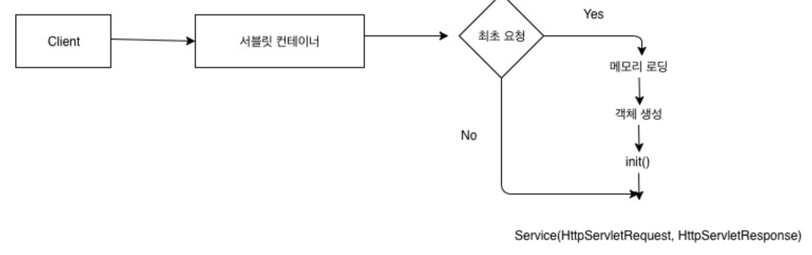
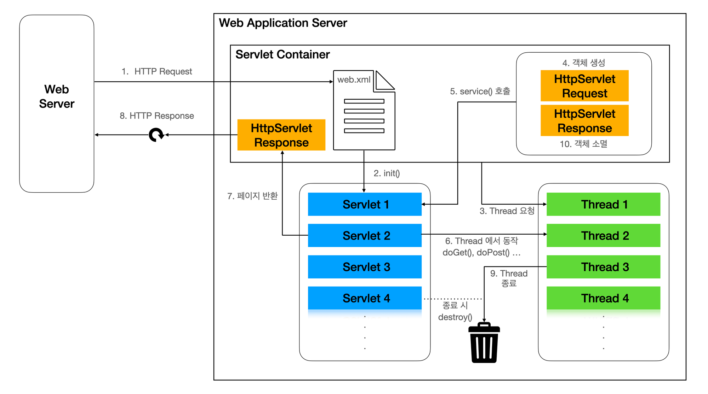

### 스프링부트 개념정리 10강 - 서블릿 객체의 생명주기가 궁금해요!

#

### 1. 스프링부트 동작 원리

### 1) 내장 톰켓을 가진다.

톰켓을 따로 설치할 필요 없이 바로 실행 가능하다.

### 2) 서블릿 컨테이너

 

- 클라이언트가 요청하면 서블릿 컨테이너(톰켓)이 요청을 받고 최초 요청이면 객체를 생성하고 최초 요청이 아니면 이미 만들어진 객체를 재사용한다.
- 정적인 파일 요청은 아파치가 응답한다.(톰켓 응답 X) java 파일 요청 시 톰켓이 응답한다.
- 스프링에서도 .html, .css, .png 등 파일을 요청하면 톰켓이 응답하지 않는다. 그러나 스프링에서는 .html, .css, .png 등 파일을 요청할 수 없다.
- **URL은 자원에 접근할 때 사용하는 주소 요청 방식이고, URI는 식별자를 통하여 접근하는 방식이다. 스프링에서는 URL 접근 방식을 이용하지 못한다.** 따라서 특정한 파일 요청을 할 수 없다. 요청 시에는 무조건 자바가 호출되야(톰켓이 컴파일해야) 한다.
    
    URL 예시 : http://naver.com/a.png
    
    URI 예시 : http://naver.com/picture/a
    
- **요청이 왔을 때 서블릿 컨테이너가 객체를 생성하는 방법**
    1. 최초 요청이 들어오면 서버는 서블릿 객체를 생성한다. 서블릿 객체 초기화 메서드인 init()이 호출된다. init()은 기존에 서버가 가지고 있던 스레드가 호출한다.
    2. Service() 메서드를 호출한다. Service() 메서드에서는 Post, Get, Put, Delete로 요청했는지 확인한다. Service()는 호출 전에 새로운 스레드가 만들어져서 새 스레드(스레드1)가 Service()를 호출한다.
    3. 2번에서 확인한 요청된 메서드가 호출된다. 요청된 메서드(예시-Get) 내에서 DB연결을 하여 데이터 찾아 html에 담아 응답한다.
    4. 두 번째 요청이 들어오면 init()을 호출하지 않고 재사용한다. 새로운 스레드가 만들어져서 새 스레드(스레드2)가 Service()를 호출하여 Post, Get, Put, Delete로 요청했는지 확인한다. 
    5. 4번에서 확인한 요청된 메서드가 호출된다. 요청된 메서드(예시-Get) 내에서 DB연결을 하여 데이터 찾아 html에 담아 응답한다.
- **자바의 메모리 영역**
    - Static, Heap, Stack
    - Hello() 메서드를 가진 클래스A가 있을 때 A 객체 생성(new) 시 heap 영역에 A 내에 선언된 static이 아닌 선언이 올라간다. (Hello() 적재된다.)
    - 메서드가 호출되면 Stack 영역에 Hello() 메서드 내부에 선언이 올라간다. Stack 영역에 적재된 메서드 영역은 독립적이다. 요청하는 사람마다 모두 다른 공간으로 공유하지 않는다. (예시 - Hello() 메서드를 3명이 호출하면 3개의 서로 다른 Hello() 메서드 공간이 Stack 영역에 생성된다.)
- **톰켓 스레드 설정을 Auto(만약 20개)로 설정했다면 20개의 요청을 받아 처리 가능하고 21번째 요청이 들어오면 더이상 스레드 생성이 불가능하기 때문에 1번째 요청이 응답(스레드 종료)될 때까지 대기해야 한다.** 스레드 종료 시점은 응답(response) 시이다.
- 스레드1이 요청을 받아 DB에 연결하여 데이터를 담아 응답하면 스레드1은 할 일 완료한다. 그러면 스레드1을 메모리에서 삭제하지 않고 21번째 대기하던 요청이 스레드1을 재사용한다. 이러한 기능을 **Pooling 기법** 이라고 한다.
- **정리**
    1. request(요청)가 들어오면 서버는 최초 요청 시에만 서블릿 객체를 만든다. 
    2. 필요한 메서드를 호출한다. 메서드 호출 시에는 새로운 스레드(스레드1)가 만들어진다.
    3. response(응답) 한다. 새로운 스레드(스레드1)은 작업을 종료하였으나 삭제하지 않고 재사용하기 위해 남겨 놓는다. 
    4. 새로운 요청이 들어오면 서블릿 객체는 다시 만들지 않고(재사용) 스레드1이 놀고 있으므로 재사용하여 응답한다.
    5. 클라이언트가 20명이 동시 접근하면 max 스레드 20개 설정되어 있을 경우 스레드가 20개까지 늘어난다. 20개의 스레드가 메서드를 실행하고 응답하는 과정을 진행한다.
    6. 클라이언트가 동시 접근을 25명이 하게 되면 스레드가 20개 밖에 없으므로 5명은 대기한다. 20개의 스레드 중 response를 한 스레드가 생기면 그 스레드를 재사용한다. 
    - 서블릿 객체와 스레드 모두 재사용된다. 그러나 서블릿 객체의 총 갯수는 무조건 1개이고, 스레드의 갯수는 컴퓨터 성능마다 달라진다.
    - 만약 컴퓨터 성능이 100명까지 버틸 수 있다면 스레드를 100개까지 생성 가능하도록 설정한다. 이러한 기술을 Pooling 기술이라고 한다.
    - 만약 컴퓨터는 100명까지 버틸 수 있지만 서비스가 1000명까지 접속해야 한다면 두 가지 방법이 있다.
        1. **scale-up** : 컴퓨터의 성능을 업그레이드하여 스레드를 1000명을 받을 수 있도록 하는 방법이다.
        2. **scale-out** : 분산 처리하여 100명을 받을 수 있는 컴퓨터를 10개를 만든다.

#

### URI(Uniform Resource Identifier)

- 통합 자원 식별자로, 인터넷 상의 리소스 자원 자체를 식별하는 고유한 문자열 시퀀스이다.
- URI의 하위 개념으로 URL과 URN 등이 존재한다.

### URL(Uniform Resource Locator)

- 네트워크상에서 통합 자원(리소스)의 위치를 나타내기 위한 규약이다.
- 자원 식별자와 위치를 동시에 보여준다.
- URL의 구성 요소
    1. Protocal : 자원에 접근할 방법을 정의해 놓은 통신 규약이다.
    2. Host name : 연결할 서버의 IP주소 또는 도메인이다.
    3. Port : 연결할 서버의 IP주소 또는 도메인에서 프로세스를 구분하기 위해 존재한다.
    4. Path or Query : Path는 웹에서 자원에 대한 경로이고 Query of Parameter는 경로 외의 추가적으로 서버에서 자원을 식별하기 위해 필요한 것이 있을 때 전달하는 ? 뒤의 key와 value로 이루어져 있는 형식이다.

### URN(Uniform Resource Name)

- 리소스의 고유한 이름을 통해 식별한다.

### Servlet

- javax.servlet 패키지 안에 정의된 인터페이스이며, HTTP 요청, 응답을 처리하며 웹페이지를 동적으로 생성하는 역할을 한다. 기본적으로 init, service, destroy 메소드가 정의되어 있다.
- 대표적으로 DispatcherServlet, HttpServlet 등의 구현체가 있다.

### **Servlet과 Servlet Container의 동작방식**

**1. 서블릿의 생성**

- 서블릿 컨테이너는 요청에 따라 필요한 서블릿들을 init() 메소드를 통해 초기화 한다.
- init() 메소드는 생성되는 시점 딱 한번 실행되며, 자원들을 미리 불러오고 설정값을 초기화하는 등의 작업을 하며 Spring Container를 사용하여 빈객체를 생성/주입 받을 수도 있다.
- 이후 초기화된 서블릿 인스턴스들은 메모리에 상주하게 되며 생명주기가 시작된다.

**2. 웹 브라우저에서 요청이 들어왔을때**

- 해당 URL의 정보를 분석하여 요청을 처리할 web.xml에 등록된 서블릿 찾는다.
- 서블릿에 대한 Thread를 생성하고 `HttpServletRequest` 및 `HttpServletResponse` 객체를 생성한 뒤 서블릿을 service() 메소드로 호출한다.(서블릿이 생성되지 않았다면 위 서블릿의 생성과정을 실행)
- 해당 서블릿 인스턴스는 생성된 Thread에서 동작한다.

**3. 요청을 처리할 Servlet 인스턴스 생성과 처리**

- Servlet객체는 service() 메소드가 호출되고 요청에 따라 doGet(), doPost() 등의 메소드가 호출된다.
- 이 때, Servlet Container에서 제공하는 `HttpServletRequest`와 `HttpServletResponse` 객체를 사용하여 HTTP요청 및 응답을 처리한다.
- 이후 처리된 정보를 `HttpServletResponse` 객체에 설정해주고 HTTP 응답 정보를 반환한다.
- Servlet Container는 HTTP Response 형태로 전환한 뒤 웹서버에 전달한다.
- 서블릿이 동작했던 Thread를 종료하고 `HttpServletRequest` 및 `HttpServletResponse` 객체를 소멸시킨다.

**4. 서블릿의 소멸 시기**

- 웹 어플리케이션이 종료되면 Servlet Container는 destroy() 메서드를 통해 Servlet 객체를 제거한다.
- destroy() 메서드는 Servlet 객체가 사용한 자원을 해제하는 작업을 담당하며 이후, Servlet 객체는 Garbage Collector에 의해 메모리에서 제거된다.

 

### Thread Pool

- 미리 일정 개수의 스레드를 생성하여 관리하는 기법이다.

- Thread Pool 동작 방식
    - 생성된 스레드들은 작업을 할당받기 위해 디기 상태에 있다가 작업이 발생하면 대기 중인 스레드 중 하나를 선택하여 작업을 수행한다. 작업이 완료되면 해당 스레드는 다시 대기 상태로 돌아가고, 새로운 작업을 할당받을 준비를 한다.
    
- Thread Pool 장점
    1. 자원 효율성
        
        미리 정해진 개수의 스레드를 생성하여 관리하기 때문에, 스레드 생성 및 삭제에 따른 오버헤드를 줄일 수 있다. 이는 시스템의 자원을 효율적으로 관리할 수 있고, 불필요한 자원 소모를 방지한다.
        
    2. 응답성 및 처리량 향상
        
        작업을 대기 상태로 유지하여 작업 처리 속도를 향상시킬 수 있다. 즉, 작업이 발생하면 대기 중인 스레드 중 하나를 선택하여 작업을 할당하므로, 작업 처리를 병렬로 진행할 수 있다.
        
    3. 작업 제어
        
        동시에 처리할 수 있는 작업의 개수를 제한할 수 있다. 즉, 스레드 풀의 크기를 조절하여 시스템의 부하를 조절하고, 과도한 작업 요청으로 인한 성능 저하를 방지할 수 있다.
        
    4. 스레드 관리
        
        스레드의 생명주기를 관리할 수 있다. 스레드 풀은 스레드의 생성, 재사용, 종료 등을 관리하므로, 스레드의 안전한 운영을 도와준다.

#

### 참조

<a href="https://www.inflearn.com/course/%EC%8A%A4%ED%94%84%EB%A7%81%EB%B6%80%ED%8A%B8-%EA%B0%9C%EB%85%90%EC%A0%95%EB%A6%AC">스프링부트 개념정리(이론)</a> 
<a href="https://parkyounghwan.github.io/2019/08/23/spring/java-servlet-container/">서블릿 컨테이너</a> 
<a href="https://blogshine.tistory.com/25">[Servlet, JSP] Servlet Life Cycle : Servlet 생명 주기</a> 
<a href="https://velog.io/@ahn0min/%EB%A7%A4%EB%B2%88-%ED%97%B7%EA%B0%88%EB%A0%A4%EC%84%9C-%EC%A0%95%EB%A6%AC%ED%95%98%EB%8A%94-URI-URL-URN">매번 헷갈려서 정리하는 URI, URL, URN</a> 
<a href="https://www.elancer.co.kr/blog/view?seq=74">URI와 URL, 어떤 차이점이 있나요?</a> 
<a href="https://velog.io/@cv_/%EC%84%9C%EB%B8%94%EB%A6%BF-%EC%BB%A8%ED%85%8C%EC%9D%B4%EB%84%88%EC%99%80-%EC%8A%A4%ED%94%84%EB%A7%81-%EC%BB%A8%ED%85%8C%EC%9D%B4%EB%84%88Servlet-Container-Spring-Container">서블릿 컨테이너와 스프링 컨테이너(Servlet Container, Spring Container)</a> 
<a href="https://engineerinsight.tistory.com/197">[JAVA] 쓰레드 풀(Thread Pool): 개념, 장점, 사용 방법, 코드 예시 (feat. Baeldung)</a> 
