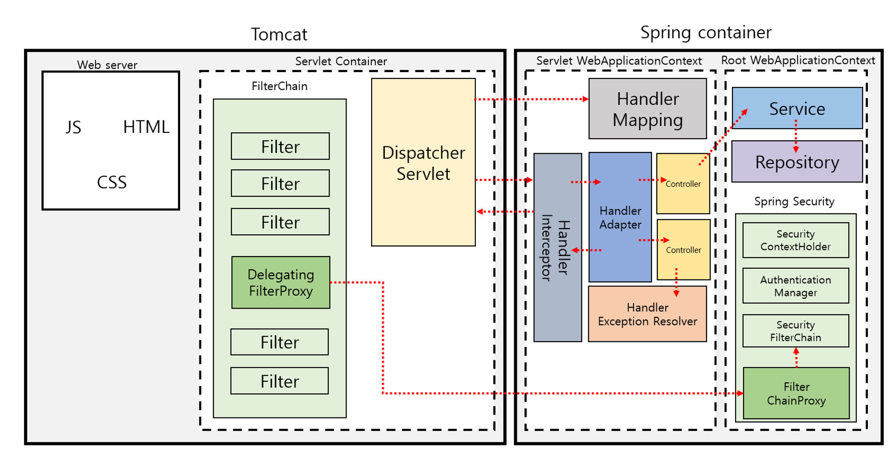

### 스프링부트 개념정리 11강 - 웹 배포서술자(web.xml)에 대해서 알려줘요!

#

### 1. 스프링부트 동작 원리

### 1) 내장 톰켓을 가진다.

톰켓을 따로 설치할 필요 없이 바로 실행 가능하다.

### 2) 서블릿 컨테이너

<br>

### 3) web.xml

web.xml 성이 있다. 입구에는 문지기가 있다. 문지기는 스스로 일을 할 수 없고, 관리자가 문서대로 일하도록 문지기에게 지시한다. 관리자가 변경될 때마다 문지기가 하는 일은 달라질 수 있으나 문지기가 달라질 일은 없다. 문지기가 하는 일이 아래와 같은 일들이다.

- ServletContext의 초기 파라미터
    - 초기 파라미터는 설정해 놓으면 web.xml 내부에서 어디에서든지 동작할 수 있다.
    - 예시 - 초기 파라미터 : 암구호 : 왈
        
        web.xml 성 내부에서 암구호를 물어봤을 때 답할 수 있어야 한다. 문이 아닌 곳을 통해 들어온 사람은 답하지 못한다.
        
- Session의 유효시간 설정
    - session은  인증을 통해 들어오는 것이다. 대상을 확인할 수 있는 주민등록번호 또는 공인인증서와 같은 것이 있다.
    - 예시 - session : 3일
        
        web.xml 성 내부에 3일(session)만큼 체류할 수 있다. 더 있고 싶으면 문지기에게 가서 누구인지 알리고 기간을 초기화해야한다. 몰래 들어온 사람은 문지기에게 갈 수 없으므로 튕겨 나간다.
        
- Servlet/JSP에 대한 정의
- Servlet/JSP 매핑
    - A가 web.xml 성에 들어올 때 목적지가 있을 것이다. 문지기가 물었을 때 A가 ‘다’라는 곳으로 이동한다고 답할 수 있다. 문지기는 A를 ‘다’로 보낸다. 문지기는 A의 ‘다’를 보고 위치(주소로 가는 길)를 알려줄 수 있다.
    - Servlet 매핑은 요청한 식별자(자원)가 어디라는 것을 정확히 알려주고 이동할 수 있도록 도와준다. web.xml은 자원의 위치가 적힌 문서를 가지고 있다.
- Mime Type 매핑
    - Mime Type은 web.xml 성에 A가 들어올 때 가져오는 자원(데이터)의 타입이다.
    - Mime Type을 가지고 오지 않는 사람은 성에 들어온 목적이 성 내부의 무언가를 보기 위한 것일 것이다. 따라서 HTTP 통신의 GET 방식(SELECT)을 사용한다.
    - Mime Type 쌀을 가져오면 우선 쌀창고로 데이터를 보낸다. 쌀을 web.xml 성에서 먹을 수 있는지 없는지 판단하고 쌀을 가공한다.
    - Mime Type을 알아야지 문지기가 가져온 자원을 어디로 보내야 하는지 알 수 있다. Mime Type이 다르면 Error가 발생한다.
- Welcome File list
    - Welcome File list는 A라는 사람이 web.xml 성에 목적 및 데이터 없이 방문하였을 경우 문지기가 처리하는 방식이다.
- Error Pages 처리
    - 문지기가 모르는 곳으로 가려는 사람이 들어올 시 Error Pages로 보낸다.
- 리스너/필터 설정
    - 필터는 A라는 사람이 들어올 때 A의 신분을 확인하는 것이다. 신분을 확인하여 허가된 신분만 입국할 수 있도록 확인한다. A가 web.xml 성 내부에서 소지하지 못하는 물품(총)을 소지하고 있을 때 해당 물품을 뺏고 들여보내준다.
    - 리스너는 web.xml 성 내부에 고급 관리자 집이 있다. 고급 관리자가 술을 잘 먹는 사람이 필요하여 문지기에게 요청하면 리스너를 만든다. 리스너는 술 잘먹는 사람만 확인하는 대리인으로, 문지기가 일을 하고 있지만 문지기 옆에서 대리인이 새로운 사람이 들어오는 것을 지켜보고 있다가 새로운 사람이 술을 잘 먹는 사람인지 확인하여 강제로 데려간다.
- 보안
    - 이상한 사람이 들어오면 쫒아낸다. 현상수배범이 들어오면 잡아서 감옥에 보낸다.

- web.xml은 초반에 돌아간다. 웹서버에 진입하면 최초에 도는 것이 web.xml이다.
- FrontController 패턴은 Servlet/JSP 매핑 시 문지기가 해야할 일이 많아 문지기가 하는 일을 줄여 준다.

#

### web.xml

- 자바 웹 애플리케이션을 위한 배포 디스크립터(Deployment Descriptor)로 WEB-INF 디렉토리 내부에 위치한다.
- 애플리케이션의 servlets, filters, 그 외 컴포넌트들을 구성하는 것을 도와주며, 웹 컨테이너에 구성 정보를 제공한다.

- web.xml을 통해 제공할 수 있는 구성 정보
    - 서블릿 매핑
        1. aliases 설정
            
            서블릿 이름을 실제 서블릿 클래스에 연결한다.
            
            <servlet>의 <servlet-name>과 <servlet-mapping>의 <servlet-name>은 반드시 같아야 한다.
            
            <servlet>의 <servlet-class>은 개발자가 작성한 실제 클래스 이름((패키지이름).(서블릿 클래스명))이다. 
            
        2. 매핑
            
            URL을 서블릿 이름에 연결한다.
            
            <url-pattern>은 클라이언트의 요청 URL에서 프로젝트 이름 뒤에 오는 부분으로, 슬래시(/)로 시작한다.
            
        
        `exampleServlet`은 `com.example.ExampleServlet` 클래스를 나타내며, `/example` 경로로 오는 요청을 이 서블릿이 처리하게 된다.
        
        `<init-param>`을 사용하여 서블릿 초기화 시 필요한 파라미터를 설정할 수 있다.
        
        ```xml
        <servlet>
            <servlet-name>exampleServlet</servlet-name>
            <servlet-class>com.example.ExampleServlet</servlet-class>
            <init-param>
                <param-name>exampleParam</param-name>
                <param-value>paramValue</param-value>
            </init-param>
        </servlet>
        
        <servlet-mapping>
            <servlet-name>exampleServlet</servlet-name>
            <url-pattern>/example</url-pattern>
        </servlet-mapping>
        ```
        
    
    - 보안 제약
        
        애플리케이션의 보안 제약을 정의한다.
        
        아래 예시에서는 `/secure/*` 경로에 대한 요청은 `USER` 역할을 가진 사용자만 접근할 수 있도록 설정한다.
        
        ```xml
        <security-constraint>
            <web-resource-collection>
                <web-resource-name>Protected Area</web-resource-name>
                <url-pattern>/secure/*</url-pattern>
            </web-resource-collection>
            <auth-constraint>
                <role-name>USER</role-name>
            </auth-constraint>
        </security-constraint>
        ```
        
    - 에러 페이지
        
        특정 오류 코드나 예외에 대한 사용자 정의 에러 페이지를 정의한다.
        
        아래 예시는 404 오류가 발생하면 `/error/404.html` 페이지를, 예외가 발생하면 `/error/defaultError.html` 페이지를 응답으로 제공한다.
        
        ```xml
        <error-page>
            <error-code>404</error-code>
            <location>/error/404.html</location>
        </error-page>
        
        <error-page>
            <exception-type>java.lang.Exception</exception-type>
            <location>/error/defaultError.html</location>
        </error-page>
        ```
        
    
    - 초기화 파라미터
        
        애플리케이션 전역에서 사용할 수 있는 초기화 파라미터를 정의한다.
        
        Spring 등의 프레임워크에서 애플리케이션 컨텍스트 파일의 위치를 지정할 때 유용하다.
        
        ```xml
        <context-param>
            <param-name>contextConfigLocation</param-name>
            <param-value>/WEB-INF/spring/applicationContext.xml</param-value>
        </context-param>
        ```
        
        특정 서블릿이나 필터에 대한 초기화 파라미터를 정의한다.
        
        아래 예시에서는 서블릿 초기화 시 `exampleParam` 이름의 파라미터에 `paramValue` 값을 설정한다.
        
        ```xml
        <init-param>
            <param-name>exampleParam</param-name>
            <param-value>paramValue</param-value>
        </init-param>
        ```
        
    
    - 필터
        
        필터를 정의하고, 이를 특정하는 URL 패턴 또는 서블릿에 매핑한다.
        
        `exampleFilter`는 `com.example.ExampleFilter` 클래스를 나타내며, 모든 경로(`/*`)로 오는 요청에 대해 이 필터가 적용된다.
        
        ```xml
        <filter>
            <filter-name>exampleFilter</filter-name>
            <filter-class>com.example.ExampleFilter</filter-class>
        </filter>
        
        <filter-mapping>
            <filter-name>exampleFilter</filter-name>
            <url-pattern>/*</url-pattern>
        </filter-mapping>
        ```
        
    
    - 세션 구성
        
        세션 구성 요소를 정의하며 세션 타임아웃이나 쿠키 타임아웃을 설정할 수 있다.
        
        ```xml
        <session-config>
            <session-timeout>30</session-timeout>
            <cookie-config>
                <name>MYSESSIONID</name>
                <http-only>true</http-only>
            </cookie-config>
        </session-config>
        ```
        
    - 마임 타입 매핑
        
        파일 확장자와 마임 타입 사이 매핑을 구성한다.
        
        ```xml
        <mime-mapping>
            <extension>html</extension>
            <mime-type>text/html</mime-type>
        </mime-mapping>
        
        <mime-mapping>
            <extension>jpg</extension>
            <mime-type>image/jpeg</mime-type>
        </mime-mapping>
        
        <mime-mapping>
            <extension>pdf</extension>
            <mime-type>application/pdf</mime-type>
        </mime-mapping>
        ```
        
    - welcome-file-list
        
        디렉토리 요청 시 기본적으로 제공할 파일을 정의한다. 
        
        아래 예시는 클라이언트가 디렉토리를 요청했을 때, `index.html` 또는 `index.jsp` 파일을 응답으로 제공한다.
        
        ```xml
        <welcome-file-list>
            <welcome-file>index.html</welcome-file>
            <welcome-file>index.jsp</welcome-file>
        </welcome-file-list>
        ```
        
    
    - listener
        
        리스너를 정의하여 특정 애플리케이션 이벤트를 처리한다.
        
        `ExampleListener`는 `ServletContextListener`와 같은 인터페이스를 구현하여 애플리케이션 시작 및 종료 이벤트를 처리할 수 있다.
        
        ```xml
        <listener>
            <listener-class>com.example.ExampleListener</listener-class>
        </listener>
        ```
        

### 서블릿 컨테이너안에는 기능과 상관없이 서블릿객체는 1개만 있어야하는가?(서블릿 클래스는 여러개가 존재)

### 서블릿 컨테이너와 스프링MVC의 관계

- 스프링 컨테이너의 역할과 기능
    - **스프링 컨테이너는 애플리케이션 내에서 객체(빈)의 생성, 생명주기 관리, 의존성 주입 등을 담당한다.** 이를 통해 개발자는 보다 쉽게 객체 간의 의존성을 관리하고, 애플리케이션의 결합도를 낮출 수 있다.
    - 애플리케이션의 설정 정보를 바탕으로 빈의 생성과 관리를 수행하는 과정에서 어노테이션, XML 파일 등의 다양한 방식을 통해 빈의 정의와 의존성 정보를 제공받는다.
    - 의존성 주입(DI, Dependency Injection)은 스프링 컨테이너의 핵심 기능 중 하나이다. 이를 통해 개발자는 객체를 직접 생성하고 연결하는 대신, 스프링 컨테이너가 필요한 객체를 자동으로 주입받을 수 있다.
    - 스프링 컨테이너는 애플리케이션의 구성 요소를 중앙에서 관리함으로써, 애플리케이션의 유지 보수성과 확장성을 향상시킨다. 왜냐하면 빈의 생명 주기 관리, 의존성 해결 등 복잡한 과정을 스프링 컨테이너가 대신 처리하기 때문이다.
    - 스프링 컨테이너는 AOP(Aspect-Oriented Programming)를 지원하여, 트랜잭션 관리, 로깅, 보안 등 애플리케이션의 공통 관심사를 효과적으로 관리할 수 있다. 이는 애플리케이션의 코드를 깔끔하게 유지하고, 재사용성을 높이는 데 기여한다.

- 서블릿 컨테이너의 역할과 기능
    - **서블릿 컨테이너는 웹 애플리케이션 서버(WAS)의 일부로, HTTP 요청을 받아 서블릿을 실행하고 응답을 클라이언트에게 전송하는 역할을 한다.** 이 과정에서 서블릿 컨테이너는 요청의 생명 주기 관리, 멀티스레딩 지원, 네트워크 서비스 등을 제공한다.
    - 서블릿 컨테이너는 서블릿의 초기화, 호출, 소멸 등 생명 주기를 관리한다. 클라이언트로부터 요청이 들어오면, 서블릿 컨테이너는 해당 서블릿의 인스턴스를 생성하거나 재사용하고, 요청을 처리한 후 응답을 반환한다.
    - 멀티스레딩을 통해 서블릿 컨테이너는 동시에 여러 요청을 효과적으로 처리할 수 있다. 서블릿 컨테이너는 각 요청을 별도의 스레드에서 처리하여, 하나의 요청이 다른 요청의 처리를 방해하지 않도록 한다.
    - 서블릿 컨테이너는 JSP(JavaServer Pages), 필터, 리스너 등 다양한 웹 컴포넌트를 지원하여, 웹 애플리케이션 개발을 보다 유연하고 효율적으로 만든다. 왜냐하면 이러한 컴포넌트를 통해 개발자는 요청 처리 과정을 쉽게 커스터마이징할 수 있기 때문이다.
    - 서블릿 컨테이너는 세션 관리, 보안, 파일 업로드 처리 등 웹 애플리케이션 개발에 필요한 다양한 기능을 제공한다. 이를 통해 개발자는 보다 안전하고 효과적인 웹 애플리케이션을 구축할 수 있다.

- 스프링 컨테이너와 서블릿 컨테이너의 상호 작용
    - 스프링 컨테이너와 서블릿 컨테이너는 웹 애플리케이션 개발에서 서로 다른 역할을 하지만, 함께 작동하여 강력한 웹 애플리케이션을 구축할 수 있다. **스프링 컨테이너는 애플리케이션의 비즈니스 로직과 구성을 관리하는 반면, 서블릿 컨테이너는 HTTP 요청과 응답을 처리한다.**
    - **스프링 MVC는 스프링 컨테이너와 서블릿 컨테이너가 상호 작용하는 대표적인 예이다. 스프링 MVC는 디스패처 서블릿을 통해 요청을 받고, 스프링 컨테이너 내의 컨트롤러, 서비스, 리포지토리 등의 빈을 사용하여 요청을 처리한다.**
    - 스프링 부트는 내장 서블릿 컨테이너(예: 톰캣)를 제공하여, 스프링 애플리케이션을 쉽게 배포하고 실행할 수 있게 한다. 이를 통해 개발자는 복잡한 서버 구성 없이도 스프링 애플리케이션을 빠르게 시작할 수 있다.

- 정리
    - 스프링 컨테이너와 서블릿 컨테이너는 각각 다른 목적으로 사용된다.
    - 스프링 컨테이너는 Inversion of Control(IoC)를 기반으로 애플리케이션의 객체를 관리한다. 이는 개발자가 프로그램의 흐름을 직접 제어하는 대신, 프레임워크에 의해 객체의 생명 주기가 관리된다.
    - 서블릿 컨테이너는 웹 서버와 통신하여 HTTP 요청을 받고, 서블릿을 사용하여 요청을 처리한 후 응답을 클라이언트에게 전송한다. 이 과정에서 서블릿 컨테이너는 네트워크 서비스, 스레드 관리, 서블릿 생명 주기 관리 등을 담당한다.
    
    - 스프링 컨테이너와 서블릿 컨테이너는 웹 애플리케이션 개발에 있어 서로 보완적인 역할을 한다.
    - 스프링 컨테이너는 애플리케이션의 객체 관리와 비즈니스 로직의 구현을 담당하는 반면, 서블릿 컨테이너는 HTTP 요청의 처리와 응답 전송을 책임진다.

        <br>

    

#

### 참조

<a href="https://www.inflearn.com/course/%EC%8A%A4%ED%94%84%EB%A7%81%EB%B6%80%ED%8A%B8-%EA%B0%9C%EB%85%90%EC%A0%95%EB%A6%AC">스프링부트 개념정리(이론)</a><br>
<a href="https://play-with.tistory.com/311">web.xml이란? web.xml 구성 요소</a><br>
<a href="https://jake-seo-dev.tistory.com/436">web.xml 파일이란? 그리고 web.xml 파일의 역할</a><br>
<a href="https://f-lab.kr/insight/understanding-spring-servlet-container-differences">스프링의 이해: 서블릿 컨테이너와 스프링 컨테이너의 차이점</a><br>
<a href="https://www.inflearn.com/questions/1132952/servlet%EC%97%90-%EB%8C%80%ED%95%B4-%EC%A0%9C-%EC%83%9D%EA%B0%81%EC%9D%84-%ED%95%9C%EB%B2%88-%EC%A0%95%EB%A6%AC%ED%95%B4%EB%B4%A4%EC%8A%B5%EB%8B%88%EB%8B%A4">servlet에 대해 제 생각을 한번 정리해봤습니다</a><br>
