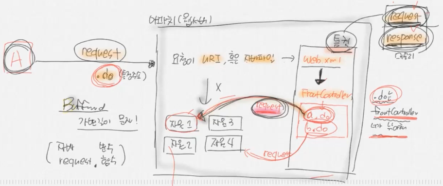
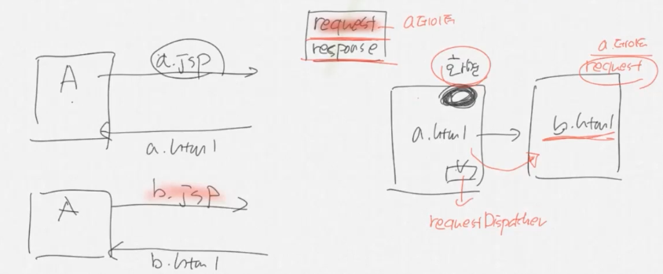
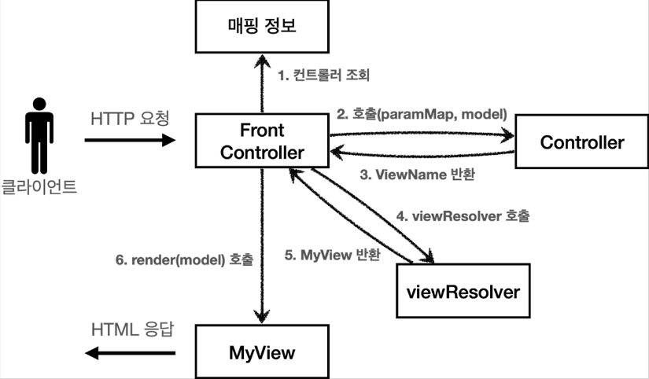
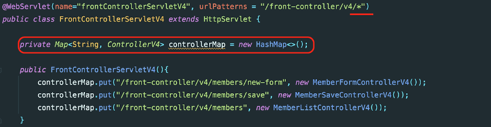
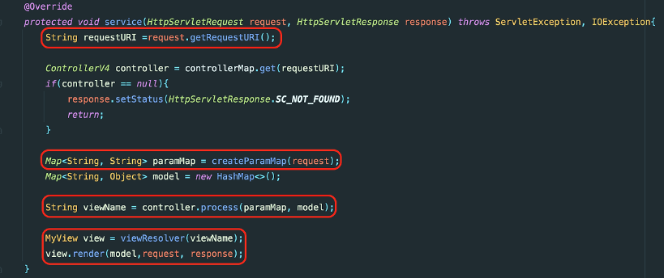
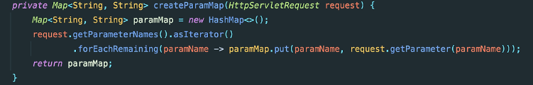
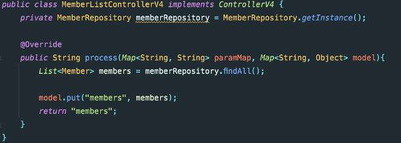
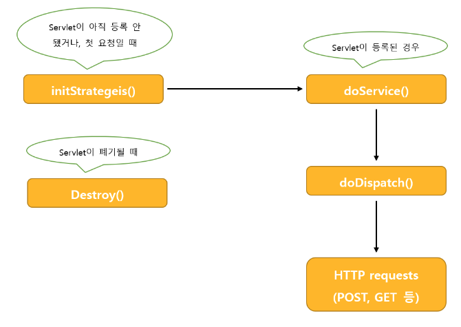
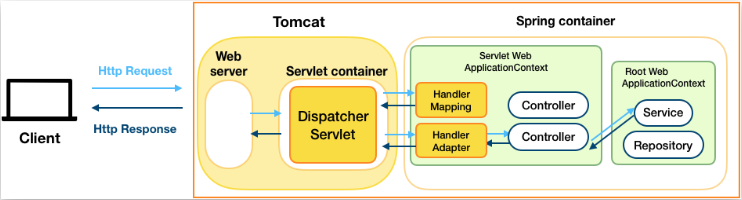

### 스프링부트 개념정리 12강 - 디스패처 서블릿이 무엇인가요?

#

### 1. 스프링부트 동작 원리

### 1) 내장 톰켓을 가진다.

톰켓을 따로 설치할 필요 없이 바로 실행 가능하다.

### 2) 서블릿 컨테이너

<br>

### 3) web.xml
- ServletContext의 초기 파라미터
- Session의 유효시간 설정
- Servlet/JSP에 대한 정의
- Servlet/JSP 매핑
- Mime Type 매핑
- Welcome File list
- Error Pages 처리
- 리스너/필터 설정
- 보안


- web.xml에서 Servlet/JSP 매핑시(web.xml에 직접 매핑 or @WebServlet 어노테이션사용)에 모든 클래스에 매핑을 적용시키기에는 코드가 너무 복잡해지기 때문에 FrontController 패턴을 이용한다.

### 4) FrontController 패턴

- 최초 앞단에서 request 요청을 받아서 필요한 클래스에 넘겨준다. 왜? web.xml에 다 정의하기가 너무 힘들다.
- 이때 새로운 요청이 생기기 때문에 request와 response가 새롭게 new될 수 있다. 그래서 아래의 RequestDispatcher가 필요하다.
    - web.xml에 request가 특정주소(.do)이면 FrontController로 보내라는 코드를 만들어 놓는다.
    - **최초의 요청(URI or 자바파일)이 왔을 때 바로 자원에 접근하지 못하고 톰켓으로 이동된다. 톰켓으로 가면 최초에 request와 response 객체를 생성한다.** request는 요청한 사람의 정보(요청한 정보, 가지고 온 정보)를 가지고 있다. 요청한 사람의 정보를 토대로 response 객체를 만든다. response 객체는 응답해줘야 하는 객체로, 응답할 데이터를 저장한다. request와 response 객체는 톰켓이 자동으로 만들어준다. 데이터가 들어올 때는 원래 가변길이의 문자를 받는 BufferedReader, BufferedWriter를 사용한다. 문자를 받아서 톰켓이 알아서 객체로 만들어 준다. 객체로 만들면 자바에서 request.(변수|함수)로 사용할 수 있다.
    - 다음 web.xml에서 web.xml의 역할을 수행한다. web.xml에 Servlet/JSP 매핑이 너무 많이 들어있으면 복잡해지므로, **특정 주소(.do)가 들어오면 FrontController가 낚아채 .do 파일이 자원을 찾아갈 수 있도록 다시 request한다.** (스프링은 request를 할 때 자원에 접근하지 못하도록 막아 놓지만, 내부에서는 자원에 접근이 가능하다.) FrontController가 .do파일이 자원을 찾아갈 수 있도록 하는 것도 요청(request)이다. **FrontController가 새로운 요청을 하면 톰켓이 만든 request, response 객체가 새로운 request, response 객체로 바뀐다.**
        
        예시 - 만약 A라는 것을 요청하여 톰켓이 A라는 정보를 가진 request, response 객체를 생성하여 가지고 있다. FrontController가 a.do를 통해서 내부적으로 다시 request하게 되면 자원이 응답해야 하는 곳은 a.do가 된다. 따라서 자원이 요청한 A로 응답하도록 하기 위하여 톰켓이 만든 A 정보를 가진 request, response 객체에 FrontController의 요청을 덮어씌운다. 덮어씌우면 A 정보를 가진 request, response 객체가 사라지게 되므로 A 정보를 가진 request, response 객체를 유지하는 방법이 필요하다. FrontController 요청 시 A 정보를 가진 request, response 객체를 삭제하지 않고 FrontControoler 요청(재요청) 시 A 정보를 가진 request, response 객체를 그대로 가져가는 방법이 있다. 
        
        **정리 - 요청 시마다 request, response 객체가 새로 만들어진다. 그러나 FrontController에서 재요청 시 기존의 요청 정보(request, response 객체)가 사라지는 것을 방지하기 위하여 기존의 request 정보를 유지하는 기법이 requestDispatcher이다.**
        
        <br>
        

### 5) RequestDispatcher

- RequestDispatcher의 역할은 필요한 클래스 요청이 도달했을 때 FrontController에 도착한 request와 response를 그대로 유지시켜준다.
    - 사용 예시 - A라는 사람이 a.jsp 파일을 요청하면 a.html 파일로 응답할 것이다. A 사람은 웹브라우저로 요청했기 때문에 브라우저 화면에 a.html이 있을 것이다. A의 a.jsp 요청에 대하여 request 객체와 response 객체가 만들어졌을 것이다. A가 응답받은 a.html 화면에서 버튼을 클릭하여 다음 페이지로 새로운 요청(b.jsp)을 할 수 있다. 그럼 요청 b.jsp에 대한 b.html을 응답한다. A는 b.html을 보게된다.
        
        a.html에 대한 정보는 a.jsp 요청에 대한 request와 response 객체가 가지고 있다. 새로운 요청(b.jsp)이 일어나면서 a.jsp 요청에 대한 request와 response 객체는 사라진다. a.jsp 요청에 대한 request와 response 객체가 사라지지 않도록 새로운 요청 시 requestDispatcher 방식을 이용하면 b.html에서 기존의 a.jsp 요청에 대한 request와 response 객체를 그대로 사용할 수 있다. (a 데이터 유지 가능하다.) **requestDispatcher를 이용해야지 페이지간 데이터 이동이 가능하다.**
        
        <br>
        

### 6) DispatchServlet

- FrontController 패턴을 직접 짜거나 RequestDispatcher를 직접 구현할 필요가 없다. 왜냐하면 스프링에는 DispatchServlet이 있기 때문이다. DispatchServlet은 FrontController 패턴 + RequestDispatcher이다.
- DispatchServlet이 자동 생성되어 질 때 수 많은 객체가 생성(IoC)된다. 보통 필터들이다. 해당 필터들은 내가 직접 등록할 수도 있고, 기본적으로 필요한 필터들은 자동으로 등록 되어진다.
    - 스프링에서는 FrontController 패턴과 RequestDispatcher를 합한 DispatchServlet을 제공한다.
    - DispatchServlet이 자동 생성되어 질 때 수 많은 객체(필터, 컨트롤러, 리포지토리, 서비스, 빈)들이 생성된다.

#

### DispatchServlet
- DispatchServlet은 FrontController 패턴으로 구현되어 있다.
- 프론트 컨트롤러(Front Controller)는 모든 컨트롤러의 앞 단에서 서블릿 하나로 클라이언트의 모든 요청을 받는다. 그리고 프론트 컨트롤러가 요청에 맞는 컨트롤러를 찾아서 호출하는 패턴이다. 이를 통해 프론트 컨트롤러는 각 컨트롤러에서 부담해야 하는 공통적인 로직을 혼자 처리해줄 수 있게 되었고, 나머지 컨트롤러들은 불필요한 서블릿을 사용하지 않아도 되는 장점이 있다.


- **프론트 컨트롤러 역할**
    <br>
    - 프론트 컨트롤러는 controllerMap Map객체에 프론트 컨트롤러가 요청해줄 수 있는 컨트롤러를 담아둔다.
    
    <br>
    
- 프론트 컨트롤러의 service() 메서드에서 아래 역할을 수행한다.
    
    <br>
    

1. 프론트 컨트롤러는 request 서블릿에서 현재 요청의 URI를 파싱하고 프론트 컨트롤러가 가지고 있던 controllerMap에서 매칭되는 컨트롤러를 가져온다.
2. createParamMap 메서드를 호출하여 paramMap을 만들고, 해당 request가 가지고 있는 파라미터들의 정보를 담는다. 
    
    <br>
    
3. 클라이언트가 실제로 요청을 한 컨트롤러의 process() 메서드를 통해 viewName을 반환한다. 아래 컨트롤러의 process() 메서드는 유저 전체를 조회한다. 해당 컨트롤러에서는 레포지토리를 조회하여 유저들을 모델에 담아주고, "members"라는 viewPath를 반환한다.
    
    <br>
    
    각 컨트롤러마다 process()에 해당하는 비즈니스 로직이 다르기 때문에 개별 컨트롤러는 아래와 같은 컨트롤러 인터페이스에 의존하고, process() 메서드를 오버라이딩하여 구현한다. 아래는 개별 컨트롤러의 인터페이스이다.
    
    ```java
    public interface ControllerV4 {
        /**
         *
         * @param paramMap
         * @param model
         * @return viewname
         */
        String process(Map<String, String> paramMap, Map<String, Object> model);
    
    }
    ```
    
4. 마지막으로, 프론트 컨트롤러는 개별 컨트롤러에게 넘겨받은 viewName에 대해 뷰 리졸버(ViewResolver)를 통해 원본 URI을 알아낸다. 
    
    ```java
    private MyView viewResolver(String viewName) {
        return new MyView("/WEB-INF/views/" + viewName + ".jsp");
    }
    ```
    
5. 프론트 컨트롤러 역할 종료

- **정리**
    
    프론트 컨트롤러는 클라이언트의 요청을 받아서 request 서블릿의 파라미터를 파싱해주고, 개별 컨트롤러에게 비즈니스 로직을 수행하여 model에 값을 담게 했다. 그리고 개별 컨트롤러에서 반환해준 viewName을 통해 MyView라는 객체를 생성하여 렌더링을 한다. 프론트 컨트롤러가 반환해준 MyView 객체는 HtppServletRequest, HttpServletResponse를 사용한다. 프론트 컨트롤러가 이미 개별 컨트롤러에서 받아온 model에 담겨있는 값을 request 서블릿에 저장하고 Dispatcher를 통해 사용자가 요청한 viewPath로 포워딩 해주는 역할을 한다.
    ```java
    public class MyView {
        private String viewPath;

        public MyView(String viewPath){
            this.viewPath = viewPath;
        }

        public void render(Map<String, Object> model, HttpServletRequest request, HttpServletResponse response) throws ServletException, IOException{
            modelToRequestAttribute(model, request);
            RequestDispatcher dispatcher = request.getRequestDispatcher(viewPath);
            dispatcher.forward(request, response);
        }

        private void modelToRequestAttribute(Map<String, Object> model, HttpServletRequest request) {
            model.forEach((key, value) -> request.setAttribute(key, value));
        }
    }
    ```
 ### **DispatcherServlet 라이프 사이클**

- DispatcherServlet도 결국 Servlet이므로 Servlet의 라이프 사이클을 따른다.
    
    <br>
    
    1. initStrategies() - 기본 세팅
        
        DispatcherServlet을 기본 세팅하는 과정이다.
        
    2. doService() - 실행 준비
        
        FrameworkServlet의 메소드를 오버라이드한 것으로, HttpServlet의 service()와 기능은 동일하나, 독자적인 메소드이다. 즉, HttpServlet에 의존하지 않는다. (FrameworkServlet은 HttpServlet을 상속/구현 한다. 하지만 DispatcherServlet은 service()가 아닌 독자적인 doService()를 사용한다.)
        
        DispatcherServlet의 request 속성을 설정하며, doDispatch()를 실행한다.
        
    3. doDispatch() - 실제 실행
        
        프론트 컨트롤러 역할을 수행한다.
        
    4. destroy()
        
        DispatcherServlet 또한 사용시에 Bean 등록되므로, Spring에 의해 Bean이 폐기될 때 같이 폐기된다.

### **Tomcat, Spring MVC의 동작 과정**

<br>

- **Tomcat**
    
    ‘WAS(Web Application Server)’의 대표적인 미들웨어 서비스로, 대표적인 미들웨어인 아파치(Apache)의 기능 일부분을 가져와 함께 사용되면서 웹서버(Web Server)의 기능과 웹 애플리케이션 서버(Web Application Server) 모두를 포함하고 있다.
    
- **Servlet container**
    
    톰캣의 메인 기능으로, 서블릿의 로드, 초기화, 호출, 소멸까지의 라이프사이클을 직접적으로 관리해주는 역할을 한다. 서블릿으로 구현된 DispatcherServlet 역시 서블릿 컨테이너에서 수행된다. 서블릿 컨테이너는 웹서버와 통신을 통해 클라이언트의 request를 전달받아 동적 서비스를 response를 해야하는데, 해당 통신을 위해 소켓을 만드는등의 역할을 진행한다. 클라이언트로부터 request를 받을때마다 쓰레드를 생성해 요청을 처리한다.
    
- **Spring container**
    
    `DispatcherServlet` 내부에 `Servlet WebApplicationContext`와 `Root WebApplicationContext`가 동작하는것으로 보이지만 이 두 ApplicationContext가 바로 process 그림에서 보셨던 Spring container에서 동작하는 컨텍스트라고 이해해주시면 될 것 같습니다. 스프링컨테이너는 Java object인 `빈`(Bean)의 라이프 사이클 관리하여 Spring 프레임워크의 특징인 `IOC(제어역전)`와 `DI(의존성주입)`을 제공해주는 역할을 한다.

#

### 참조

<a href="https://www.inflearn.com/course/%EC%8A%A4%ED%94%84%EB%A7%81%EB%B6%80%ED%8A%B8-%EA%B0%9C%EB%85%90%EC%A0%95%EB%A6%AC">스프링부트 개념정리(이론)</a><br>

### DispatchServlet
<a href="https://studyandwrite.tistory.com/461">[스프링/Spring] FrontController 패턴과 스프링 MVC</a><br>
<a href="https://mangkyu.tistory.com/18">[Spring] Dispatcher-Servlet(디스패처 서블릿)이란? 디스패처 서블릿의 개념과 동작 과정</a><br>
<a href="https://mangkyu.tistory.com/13">[Spring] Dispatcher-Servlet 설정</a><br>


### **DispatcherServlet 라이프 사이클**
<a href="https://velog.io/@seculoper235/3">3. DispatcherServlet의 원리</a><br>
<a href="https://rlaxogns2.tistory.com/15">SpringMVC(get, post 방식으로 값 넘기기)</a><br>


### **Tomcat, Spring MVC의 동작 과정**
<a href="https://taes-k.github.io/2020/02/16/servlet-container-spring-container/">Tomcat, Spring MVC의 동작 과정</a><br>
<a href="https://velog.io/@choidongkuen/Spring-Spring-MVC-Servlet-Servlet-Container-란">[Spring] Spring MVC - Servlet, Servlet Container, Spring Container 에 대해</a><br>
<a href="https://steady-coding.tistory.com/599">[Spring] Servlet, Servlet Container, Spring MVC 정리</a><br>

