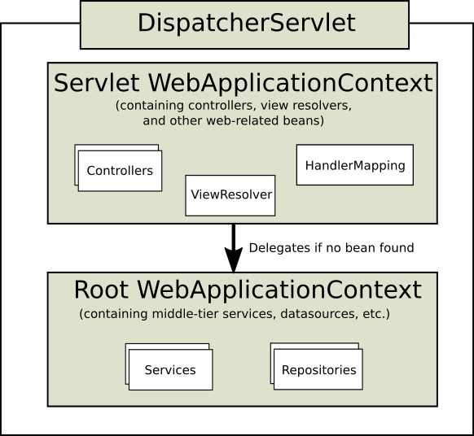

### 스프링부트 개념정리 13강 - 애플리케이션 컨텍스트란 무엇인가요?

#

### 1. 스프링부트 동작 원리

### 1) 내장 톰켓을 가진다.

톰켓을 따로 설치할 필요 없이 바로 실행 가능하다.

### 2) 서블릿 컨테이너

<br>

### 3) web.xml
- ServletContext의 초기 파라미터
- Session의 유효시간 설정
- Servlet/JSP에 대한 정의
- Servlet/JSP 매핑
- Mime Type 매핑
- Welcome File list
- Error Pages 처리
- 리스너/필터 설정
- 보안


- web.xml에서 Servlet/JSP 매핑시(web.xml에 직접 매핑 or @WebServlet 어노테이션사용)에 모든 클래스에 매핑을 적용시키기에는 코드가 너무 복잡해지기 때문에 FrontController 패턴을 이용한다.

## 4) FrontController 패턴

- 최초 앞단에서 request 요청을 받아서 필요한 클래스에 넘겨준다. 왜? web.xml에 다 정의하기가 너무 힘들다.
- 이때 새로운 요청이 생기기 때문에 request와 response가 새롭게 new될 수 있다. 그래서 아래의 RequestDispatcher가 필요하다.

## 5) RequestDispatcher

- 필요한 클래스 요청이 도달했을 때 FrontController에 도착한 request와 response를 그대로 유지시켜준다.

## 6) DispatchServlet

- FrontController 패턴을 직접 짜거나 RequestDispatcher를 직접 구현할 필요가 없다. 왜냐하면 스프링에는 DispatchServlet이 있기 때문이다. DispatchServlet은 FrontController 패턴 + RequestDispatcher이다.
- DispatchServlet이 자동 생성되어 질 때 수 많은 객체가 생성(IoC)된다. 보통 필터들이다. 해당 필터들은 내가 직접 등록할 수도 있고, 기본적으로 필요한 필터들은 자동으로 등록 되어진다.

## 7) 스프링 컨테이너

- DispatchServlet에 의해 생성되어지는 수 많은 객체들은 어디에서 관리될까?
    - 스프링은 모든 서블릿을 요청하므로 외부에서 요청이 오면  web.xml에서 스프링 내부로 들어가기 위해서 두 가지 일을 한다. 첫 번째는 FrontController 패턴을 사용하므로 DispatchServlet이 동작한다. DispatchServlet은 컴포넌트 스캔을 한다. DispatchServlet이 주소를 분배하기 위해서는 클래스들이 메모리에 있어야 보낼 수 있다. src 소스 폴더 안에 있는 자바 파일이 메모리에 있어야 한다. static 자바 파일은 메인 메소드가 실행되기 전부터 메모리에 생성된다. 일반 자바 파일은 프로그램 실행 중 생성과 소멸을 반복한다. 모든 파일을 static으로 만들면 모두 공유되어 불편하다. 대부분의 자바 파일은 new로 생성해야 한다. 스프링은 IoC를 사용하여 DispatchServlet이 객체를 생성(new)한다. DispatchServlet이 컴포넌트 스캔을 통해서 src 내부의 모든 파일을 모두 객체를 생성(new)해 준다. 스캔의 범위를 설정할 수 있지만 스프링부트 버전부터는 특정 패키지 이하는 ALL 스캔한다. 컴포넌트 스캔은 해당 범위 이하의 경로를 모두 찾아 필요한 것을 메모리에 올린다. 필요한 것은 스프링에서 특정 목적에 의하여 어노테이션으로 정해져 있다. @controller, @RestController, @Repository, @Service, @Component 등 어노테이션이 있으면 DispatchServlet이 메모리에 띄워 IoC로 관리한다. 따라서 IoC 컨테이너의 메모리에 자바 클래스를 객체로 띄우고 싶으면 어노테이션을 사용하여 메모리에 띄울 수 있다. (어노테이션을 직접 만들 수 있다.) 메모리에 객체가 올라가면 DispatchServlet이 분배할 수 있다.
        
        ⇒ 정리 : 외부에서 요청이 들어오면 DispatchServlet은 컴포넌트를 스캔을 통하여 src 소스 폴더의 모든 파일의  @controller, @RestController, @Repository, @Service, @Component 등 어노테이션을 확인하여 객체를 생성하고 주소를 분배한다. 
        
    - DispatchServlet에 진입하기 전에 context Loader Listener가 있다. 서블릿이 만들어지면 스레드가 생성된다. 요청한 사람이 100명이고 최대 스레드가 20개일 경우 스레드가 20개 만들어진다. 각각의 스레드는 독립적이므로, 서로 영향을 받지 않는다. 요청1에서 스레드1가 생성되고 각 객체가 만들어지고, 요청2에서 새로운 스레드2가 생성되고 각 객체가 새로 만들어지므로 충돌이 발생하지 않는다.
    - 컴포넌트 스캔을 통하여 IoC로 메모리에 띄우면 스레드별로 따로 관리가 된다. 그러나 모든 요청이 공통적으로 사용해야 하는것이 있다. DB Connection는 모든 요청에서 계속 new할 필요 없이 공통적으로 사용한다. 즉, DB에 관련된 것과 모든 스레드가 공통적으로 사용해도 되는 것은 미리 Context Loader Listener를 통하여 띄운다. Context Loader Listener는 root-applicationContext 파일을 읽는다. root-applicationContext 파일은 스레드에서 공통적으로 사용하는 것을 메모리에 띄우고 IoC컨테이너에서 관리한다.
    - root-applicationContext 파일에서 만든 객체(DB 객체 등)는 DispatchServlet이 메모리에 띄운 객체에 접근할 수 없다. 그러나 반대로 DispatchServlet이 메모리에 띄운 객체에서 DB에 접근이 가능하다. 그래서 DB접근 객체는 root-applicationContext 파일에서 메모리에 띄우고, DispatchServlet이 메모리에 띄운 객체에서 접근하여 사용한다.
    
    <br>
    
- **첫째, ApplicationContext**
    
    수 많은 객체들이 ApplicationContext에 등록된다. 이것을 IoC라고 한다. IoC란 제어의 역전을 의미한다. 개발자가 직접 new를 통해 객체를 생성하게 된다면 해당 객체를 가르키는 레퍼런스 변수를 관리하기 어렵다. 그래서 스프링이 직접 해당 객체를 관리한다. 이때 우리는 주소를 몰라도 된다. 왜냐하면 필요할 때 DI하면 되기 때문이다. DI를 의존성 주입이라고 한다. 필요한 곳에서 ApplicationContext에 접근하여 필요한 객체를 가져올 수 있다. ApplicationContext는 싱글톤으로 관리되기 때문에 어디에서 접근하든 동일한 객체라는 것을 보장해준다.
    
    ApplicationContext의 종류에는 두 가지가 있는데 (root-applicationContext와 servlet-applicationContext)이다.
    
    servlet-applicationContext는 ViewResolver, Interceptor, MultipartResolver 객체를 생성하고 웹과 관련된 어노테이션 Controller, RestController를 스캔한다.
    
    (웹과 관련된 어노테이션만 스캔하여 메모리에 띄운다.)
    
    ⇒ 해당 파일은 DispatchServlet에 의해 실행된다.
    
    <br>
    

root-applicationContext는 해당 어노테이션을 제외한 어노테이션 Service, Repository 등을 스캔하고 DB관련 객체를 생성한다. (스캔이란 : 메모리에 로딩한다는 뜻)

⇒ 해당 파일은 ContextLoaderListener에 의해 실행된다. ContextLoaderListener를 실행해주는 녀석은 web.xml이기 때문에 root-applicationContext는 servlet-applicationContext보다 먼저 로드 된다. 당연히 servlet-applicationContext에서는 root-applicationContext가 로드한 객체를 참조할 수 있지만 그 반대는 불가능하다. 생성 시점이 다르기 때문이다. 

<br>

- 둘째, Bean Factory
    
    필요한 객체를 Bean Factory에 등록할 수도 있다. 여기에 등록하면 초기에 메모리에 로드되지 않고 필요할 때 getBean()이라는 메소드를 통하여 호출하여 메모리에 로드할 수 있다. 이것 또한 IoC이다. 그리고 필요할 때 DI하여 사용할 수 있다. ApplicationContext와 다른 점은 Bean Factory에 로드되는 객체들은 미리 로드되지 않고 필요할 때 호출하여 로드하기 때문에 lazy-loading이 된다는 점이다. (필요할 때 메모리에 로드된다.)
    
    - Bean Factory에 등록하기 위해서는 클래스에 @Configuation 어노테이션을 붙이고, 내부에 객체를 반환하는 메소드가 있다면 객체를 반환하는 메소드에 @Bean 어노테이션을 사용하여 메모리에 띄울 수 있다.

#

### 스프링 컨테이너(Spring Container)

- 내부에 존재하는 빈의 생명주기를 관리(빈의 생성, 관리, 제거 등)하며, 생성된 빈에게 추가적인 기능을 제공한다. (스프링에서 자바 객체를 빈(Bean)이라 한다.)
- 스프링 컨테이너는 BeanFactory와 ApplicationContext 인터페이스로 이루어져 있다.

### ApplicationContext

- ApplicationContext는 root-applicationContext와 servlet-applicationContext로 이루어져 있다.
- `ApplicationContext`는 `BeanFactory`를 확장한 인터페이스로, 더 많은 기능을 제공한다. 국제화 메시지 처리, 이벤트 전달, 애플리케이션 계층의 특정한 컨텍스트 기능 등을 지원한다.

- **root-applicationContext**
    - 클라이언트 요청이 들어오면 스프링의 내장 톰켓 web.xml에 정의되어 있는 ContextLoaderListener가 root-ApplicationContext.xml을 읽어 서블릿에서 공통으로 사용하는 DB connection 등과 관련된 객체를 메모리에 로드한다.
    - 메모리의 별도 공간에 존재하며, 이는 `DispatcherServlet`과 독립적으로 로드된다.
    - root-applicationContext에 정의된 Bean은 servlet-applicationContext에 정의 된 Bean을 사용할 수 없다.
    
- **servlet-applicationContext**
    - servlet-applicationContext은 DispatcherServlet가 초기화될 때 로드된다.
    - DispatcherServlet 내부에 ApplicationContext가 만들어지므로, 각 DispatcherServlet은 고유의 servlet-applicationContext를 가진다. (웹 애플리케이션에서 DispatcherServlet 을 여러 개 사용할 수 있다.)
    - `DispatcherServlet`의 `servlet-applicationContext`도 `ApplicationContext`이며, 내부적으로 `BeanFactory`를 포함한다.
    - `DispatcherServlet`의 `servlet-applicationContext`는 `root-applicationContext`를 부모 컨텍스트로 참조한다. 따라서 `servlet-applicationContext`는 `root-applicationContext`에 정의된 빈을 상속 받아 사용할 수 있다.

- **Bean 찾는 순서**
    - servlet-applicationContext에서 먼저 찾는다.
    - 만약 servlet-applicationContext에서 bean이 없는 경우 root-applicationContext에 정의된 bean을 찾는다.
    
    따라서 root-applicationContext와 servlet-applicationContext에 같은 id로 된 Bean이 등록 되는 경우 servlet-applicationContext에 선언된 Bean을 사용한다.
    

- **web.xml**
    - `ContextLoaderListener`는 `/WEB-INF/applicationContext.xml`을 로드하여 `root-applicationContext`를 생성한다. `root-applicationContext`는 애플리케이션 전반에서 사용되는 공통 빈을 관리한다.
    - `DispatcherServlet`이 초기화될 때 `/WEB-INF/dispatcher-servlet.xml` 파일을 로드하여 자신만의 `servlet-applicationContext`를 생성한다.
        
        ```sql
        <web-app>
            <!-- ContextLoaderListener 설정 -->
            <listener>
                <listener-class>org.springframework.web.context.ContextLoaderListener</listener-class>
            </listener>
            
            <!-- root-applicationContext 설정 -->
            <context-param>
                <param-name>contextConfigLocation</param-name>
                <param-value>/WEB-INF/applicationContext.xml</param-value>
            </context-param>
        
            <!-- DispatcherServlet 설정 -->
            <servlet>
                <servlet-name>dispatcher</servlet-name>
                <servlet-class>org.springframework.web.servlet.DispatcherServlet</servlet-class>
                <init-param>
                    <param-name>contextConfigLocation</param-name>
                    <param-value>/WEB-INF/dispatcher-servlet.xml</param-value>
                </init-param>
                <load-on-startup>1</load-on-startup>
            </servlet>
            
            <servlet-mapping>
                <servlet-name>dispatcher</servlet-name>
                <url-pattern>/</url-pattern>
            </servlet-mapping>
        </web-app>
        ```
        

### Bean Factory

- `BeanFactory`는 스프링의 가장 기본적인 컨테이너로, 스프링 빈의 생성, 관리 및 의존성 주입을 담당한다. 지연 로딩(lazy loading) 방식으로 빈을 초기화한다.
- 스프링은 보통의 경우 스프링 컨테이너에 빈 인스턴스를 단 한개만 저장하는 싱글톤 방식을 채택하고 있다.
- 빈 이름은 항상 다르게 지정이 되어야 한다.

- **BeanFactory의 주요 역할**
    - **빈 생성 및 관리**: 스프링 애플리케이션에서 사용하는 객체(빈)를 생성하고, 그 라이프사이클을 관리한다.
    - **의존성 주입**: 빈 간의 의존성을 주입하여, 애플리케이션의 구성 요소들이 서로 협력할 수 있도록 한다.
    - **지연 초기화**: 필요한 시점까지 빈의 초기화를 지연시켜, 메모리 사용을 최적화한다.

- **BeanFactory 생성 시점 및 위치**
    - **생성 시점**: `BeanFactory`는 스프링 애플리케이션 컨텍스트가 초기화될 때 생성된다. `ApplicationContext`는 `BeanFactory`를 포함하고 있으므로, `ApplicationContext`가 초기화될 때 `BeanFactory`도 함께 생성된다.
    - **위치**: `BeanFactory`는 `ApplicationContext` 내부에 위치한다. `ApplicationContext`는 `BeanFactory`를 확장한 것이므로, `ApplicationContext`가 빈의 생성, 관리 및 의존성 주입을 담당할 때 내부적으로 `BeanFactory`를 사용한다.

- **스프링 빈을 등록하는 방법**
    1. **컴포넌트 스캔**
        
        `@Component`어노테이션을 사용하여 스프링 빈을 자동으로 등록하는 방법이다. `@Controller`, `@Service`, `@Repository`와 같은 어노테이션은 모두 `@Component`를 상속받기 때문에 컴포넌트 스캔 시 자동으로 빈으로 등록된다.
        
        **스캔 범위**: 기본적으로, 컴포넌트 스캔은 지정된 패키지와 그 하위 패키지를 대상으로 한다. 따라서, `@Component` 어노테이션이 적용된 클래스는 해당 패키지와 하위 패키지에서만 빈으로 등록된다.
        
        ```
        ...
        @Component
        public @interface Service {
        	...
        }
        ```
        
    2. **스프링 빈 직접 등록**
        
        `@Configuration` 어노테이션을 클래스에 적용하고, 이 클래스 내에서 `@Bean` 어노테이션을 사용하여 메소드를 정의함으로써 스프링 빈을 직접 등록하는 방법이다. 개발자가 원하는 객체를 반환하는 메소드를 정의하여 빈으로 등록할 수 있다.
        
        ```
        @Configuration
        public class SpringConfig {
           @Bean
           public MemberService memberService() {
               return new MemberService(memberRepository());
           }
        }
        ```
        

- **getBean() 메서드**
    - 특정 스프링빈을 조회하는데 사용되며, 매개변수로 여러 종류가 올 수 있다.
    - 조회하고자 하는 빈이 존재하지 않으면 `NoSuchBeanDefinitionException` 예외가 발생한다.
        
        [변수명].getBean(class 타입)
        
        [변수명].getBean(빈 이름, class타입)
        
        [변수명].getBean(빈 이름)
        

### ApplicationContext와 BeanFactory의 정의 및 차이점

- **정의**
    
    **BeanFactory**: 스프링의 가장 기본적인 컨테이너로, 스프링 빈의 생성, 관리 및 의존성 주입을 담당한다. 지연 로딩(lazy loading) 방식으로 빈을 초기화합니다.
    
    **ApplicationContext**: `BeanFactory`를 확장한 인터페이스로, 보다 많은 기능(예: 국제화 메시지 처리, 이벤트 전달, 애플리케이션 계층의 특정한 컨텍스트 기능)을 제공한다. 기본적으로 모든 빈을 애플리케이션 시작 시 초기화한다.
    
- **차이점**
    1. **기능**: `ApplicationContext`는 `BeanFactory`의 모든 기능을 포함하면서도 추가적인 기능을 제공한다. 예를 들어, 이벤트 기반의 프로그래밍 모델을 지원하고, 국제화 메시지 기능을 제공한다.
    2. **초기화 시점**: `BeanFactory`는 빈을 지연 초기화(lazy loading)하며, 실제로 필요할 때 빈을 생성한다. 반면, `ApplicationContext`는 애플리케이션 시작 시 모든 싱글톤 빈을 미리 로드한다.
    3. **사용 용도**: `BeanFactory`는 메모리 효율이 중요한 환경에서 사용될 수 있다. 그러나 대부분의 애플리케이션에서는 `ApplicationContext`가 더 많이 사용된다.
- **정리**
    - **실제 개발에서는 거의 사용되지 않음**: 일반적인 애플리케이션 개발에서는 `ApplicationContext`를 사용하고, `BeanFactory`를 직접 사용하는 경우는 거의 없다.
    - **주로 ApplicationContext 사용**: 스프링 애플리케이션의 대부분의 시나리오에서 `ApplicationContext`가 제공하는 확장된 기능과 편의성 때문에 선호된다.
    - 따라서 `BeanFactory`는 더 이상 일반적인 애플리케이션 개발에서 거의 사용되지 않는다고 봐도 무방하며, 스프링 프레임워크에서 `ApplicationContext`가 표준 컨테이너로 자리 잡고 있다.
- **BeanFactory 사용 사례**
    - `BeanFactory`는 다음과 같은 특수한 경우에 사용될 수 있습니다:
    - **메모리 제약이 심한 환경**: 리소스가 매우 제한된 환경에서 지연 로딩을 통해 메모리 사용을 최적화해야 하는 경우.
    - **스프링 프레임워크 내부 구현**: 스프링 프레임워크 자체에서는 여전히 `BeanFactory`를 사용하여 핵심 기능을 구현합니다.

<br>

#

### 참조

<a href="https://www.inflearn.com/course/%EC%8A%A4%ED%94%84%EB%A7%81%EB%B6%80%ED%8A%B8-%EA%B0%9C%EB%85%90%EC%A0%95%EB%A6%AC">스프링부트 개념정리(이론)</a><br>

### 스프링 컨테이너(Spring Container)
<a href="https://chatgpt.com/">ChatGPT</a><br>
<a href="https://velog.io/@tank3a/스프링-컨테이너와-스프링-빈">스프링 컨테이너와 스프링 빈</a><br>
<a href="https://jaehun2841.github.io/2018/10/21/2018-10-21-spring-context/#Application-Context">Application-Context와 Servlet-Context</a><br>


