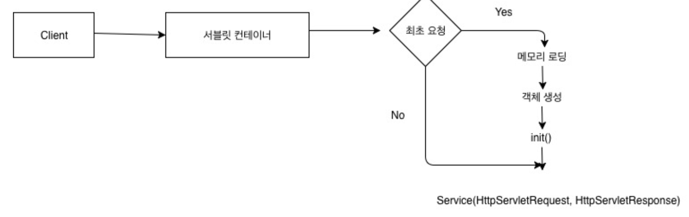

### 스프링부트 개념정리 13강 - 애플리케이션 컨텍스트란 무엇인가요?

#

### 1. 스프링부트 동작 원리

### 1) 내장 톰켓을 가진다.

톰켓을 따로 설치할 필요 없이 바로 실행 가능하다.

### 2) 서블릿 컨테이너

<br>

### 3) web.xml
- ServletContext의 초기 파라미터
- Session의 유효시간 설정
- Servlet/JSP에 대한 정의
- Servlet/JSP 매핑
- Mime Type 매핑
- Welcome File list
- Error Pages 처리
- 리스너/필터 설정
- 보안


- web.xml에서 Servlet/JSP 매핑시(web.xml에 직접 매핑 or @WebServlet 어노테이션사용)에 모든 클래스에 매핑을 적용시키기에는 코드가 너무 복잡해지기 때문에 FrontController 패턴을 이용한다.

## 4) FrontController 패턴

- 최초 앞단에서 request 요청을 받아서 필요한 클래스에 넘겨준다. 왜? web.xml에 다 정의하기가 너무 힘들다.
- 이때 새로운 요청이 생기기 때문에 request와 response가 새롭게 new될 수 있다. 그래서 아래의 RequestDispatcher가 필요하다.

## 5) RequestDispatcher

- 필요한 클래스 요청이 도달했을 때 FrontController에 도착한 request와 response를 그대로 유지시켜준다.

## 6) DispatchServlet

- FrontController 패턴을 직접 짜거나 RequestDispatcher를 직접 구현할 필요가 없다. 왜냐하면 스프링에는 DispatchServlet이 있기 때문이다. DispatchServlet은 FrontController 패턴 + RequestDispatcher이다.
- DispatchServlet이 자동 생성되어 질 때 수 많은 객체가 생성(IoC)된다. 보통 필터들이다. 해당 필터들은 내가 직접 등록할 수도 있고, 기본적으로 필요한 필터들은 자동으로 등록 되어진다.

## 7) 스프링 컨테이너

- DispatchServlet에 의해 생성되어지는 수 많은 객체들은 어디에서 관리될까?

- **첫째, ApplicationContext**
    
    수 많은 객체들이 ApplicationContext에 등록된다. 이것을 IoC라고 한다. IoC란 제어의 역전을 의미한다. 개발자가 직접 new를 통해 객체를 생성하게 된다면 해당 객체를 가르키는 레퍼런스 변수를 관리하기 어렵다. 그래서 스프링이 직접 해당 객체를 관리한다. 이때 우리는 주소를 몰라도 된다. 왜냐하면 필요할 때 DI하면 되기 때문이다. DI를 의존성 주입이라고 한다. 필요한 곳에서 ApplicationContext에 접근하여 필요한 객체를 가져올 수 있다. ApplicationContext는 싱글톤으로 관리되기 때문에 어디에서 접근하든 동일한 객체라는 것을 보장해준다.
    
    ApplicationContext의 종류에는 두 가지가 있는데 (root-applicationContext와 servlet-applicationContext)이다.
    
    servlet-applicationContext는 ViewResolver, Interceptor, MultipartResolver 객체를 생성하고 웹과 관련된 어노테이션 Controller, RestController를 스캔한다.
    
    (웹과 관련된 어노테이션만 스캔하여 메모리에 띄운다.)
    
    ⇒ 해당 파일은 DispatchServlet에 의해 실행된다.
    
    root-applicationContext는 해당 어노테이션을 제외한 어노테이션 Service, Repository 등을 스캔하고 DB관련 객체를 생성한다. (스캔이란 : 메모리에 로딩한다는 뜻)
    
    ⇒ 해당 파일은 ContextLoaderListener에 의해 실행된다. ContextLoaderListener를 실행해주는 녀석은 web.xml이기 때문에 root-applicationContext는 servlet-applicationContext보다 먼저 로드 된다. 당연히 servlet-applicationContext에서는 root-applicationContext가 로드한 객체를 참조할 수 있지만 그 반대는 불가능하다. 생성 시점이 다르기 때문이다. 
    
- 둘째, Bean Factory
    
    필요한 객체를 Bean Factory에 등록할 수도 있다. 여기에 등록하면 초기에 메모리에 로드되지 않고 필요할 때 getBean()이라는 메소드를 통하여 호출하여 메모리에 로드할 수 있다. 이것 또한 IoC이다. 그리고 필요할 때 DI하여 사용할 수 있다. ApplicationContext와 다른 점은 Bean Factory에 로드되는 객체들은 미리 로드되지 않고 필요할 때 호출하여 로드하기 때문에 lazy-loading이 된다는 점이다. (필요할 때 메모리에 로드된다.)

## 8) 요청 주소에 따른 적절한 컨트롤러 요청 (Handler Mapping)

- GET 요청 ⇒ http://localhost:8080/post/1
    
    해당 주소 요청이 오면 적절한 컨트롤러의 함수를 찾아서 실행한다.
    

## 9) 응답

- html 파일을 응답할지 Data를 응답할지 결정해야 하는데 html 파일을 응답하게 되면 ViewResolver가 관여하게 된다.
    - ViewResolver가 관여하여 응답의 패턴을 만들어준다. 어떤 파일인지에 대한 파일 패턴을 만들어 준다. 예시 - 응답할 데이터가 .JSP일 경우 .JSP 경로가 프리픽스로 붙고 .JSA 확장자가 붙어서 주소요청에 대한 파일을 리턴할 수 있는 패턴을 만들어 준다.
    - DispachServlet이 컴포넌트 스캔하여 A 클래스 띄운다. A가 리턴타입이 String인 Hello() 메소드를 가지고 있다.
        1. DispachServlet이 A를 메모리에 띄우고 주소 분배를 하기 위해서 HandlerMapping에게 넘긴다. 
        2. HandlerMapping은 적절한 함수 A를 찾아서 A의 Hello()가 실행된다. 실행 후 결과값 “hello” 메시지가 리턴이 될 것이다. ⇒ 데이터 리턴
            
            만약 “hello” 메시지가 아니라 “hello” 파일을 리턴하고 싶다면 ViewResolver관여한다. WEB-INF/views/hello.jsp가 있다. A의 Hello()메소드에서 결과 리턴 시 ‘return WEB-INF/views/hello.jsp’라고 작성한다. (”WEB-INF/views/” → prefix이고 “.jsp” → suffix)
            
- 하지만 Data를 응답하게 되면 MessageConverter가 작동하게 되는데 메시지를 컨버팅할 때 기본전략은 json이다.
    - 데이터를 응답할 경우 @ResponseBody 어노테이션을 사용한다. 어노테이션을 사용하면 리턴값을 파일로 보지 않고 데이터로 본다. 메시지 컨버터가 String을 확인한다. 요청한 사람은 hello라는 메시지를 받게 된다.
    - 만약 User 엔티티가 있고 int id, String name을 가지고 있다. id가 1이고 name이 홍길동인 User를 리턴할 때 user로 리턴하게 된다. 메시지 컨버터가 리턴값이 객체인 경우 user 객체를 JSON으로 바꿔서 응답한다. ( JSON 형식 - {”id” : 1, “name” : “홍길동”} )
    - JSON 형식으로 변경해 주는 것이 Jackson인데 데이터를 변환해주는 기능을 다이렉트로 Jackson을 사용하면 나중에 JSON 형식이 아닌 다른 형식으로 변경이 되었을 때 다 수정해주어야 한다. 따라서 MessageConverter로 추상화 하여 사용한다.
    
    <br>
    
- 최종 정리하면
    1. 톰켓이 실행될 때(서버가 켜질 때) web.xml이 문지기 역할을 하여 loading이 되고 나면 ContextLoaderListener가 실행된다.
    2. ContextLoaderListener가 Create되면서 applicationContext가 읽어진다. applicationContext가 읽어질 때 root-context.xml이 읽어진다. root-context.xml는 보통 데이터베이스 관련된 객체들을 컴포넌트 스캔하여 메모리에 올린다. (그림 가장 오른쪽 3번째 Spring Container(ROOT)에 있는 것들이 올라온다.)
    3. 사용자에게 request 요청이 들어오면 servlet-context.xml에 의해 만들어진 DispatchServlet이 동작한다. DispatchServlet은 FrontController 패턴으로 web.xml이 해야 하는 역할을 분배하여 받아 web과 관련된 객체를 생성하고 찾아가도록 분배하는 역할을 수행한다. 
    4. 요청이 끝나면 응답을 할 때 Data로 리턴할지, html 파일로 리턴할지 결정이 끝나면 정상적인 로직이 실행된다.

#

### **viewResolver**

- 사용자에게 결과를 보여주기 위한 뷰를 찾기 위해 viewResolver를 사용한다.
- DispatcherServlet은 HandlerAdapter를 통해 Controller의 반환 값인 ModelAndView를 구한다. ModelAndView 객체에는 viewName 변수가 저장되어 있으며, 이 변수를 이용하여 viewResolver에서 사용할 view를 반환한다.

- ViewResolver는 인터페이스로 구현되어 있으며 ViewResolver를 확장하여 사용한다. dispatcher-servlet.xml에 사용 할 viewResolver를 선언하여 사용할 수 있다.
- JSP 파일을 뷰로 사용할 때는 InternalResourceViewResolver를 사용하며, prefix, suffix를 명시해주어야 한다. prefix는 view파일이 존재하는 경로이고, suffix는 확장자이다.
- 아래 코드처럼 prefix와 suffix 값을 해주면 ‘/WEB-INF/views/*.jsp’ 파일을 찾게 된다.
    
    ```xml
    // dispatcher-servlet.xml
    ...
    <bean class="org.springframework.web.servlet.view.InternalResourceViewResolver">
    	<property name="prefix" value="/WEB-INF/views/"/>
    	<property name="suffix" value=".jsp"/>
    </bean>
    ...
    ```
    
- **동작 방식**
    1. Controller 요청에 의한 결과 값을 구한 뒤, mv를 processDispatchResult 메소드 호출 시, 파라미터로 넘깁니다.
        
        ```java
         // DispatcherServlet class
         ...
         // 컨트롤러의 ModelAndView 반환 값을 가져옵니다.
         mv = ha.handle(processedRequest, response, mappedHandler.getHandler());
         ...
         processDispatchResult(processedRequest, response, mappedHandler, mv, dispatchException);
         ...
        ```
        
    2. mv 객체가 존재한다면 render메소드를 호출합니다.
        
        ```java
         // DispatcherServlet class
         ...
         if (mv != null && !mv.wasCleared()) {
             render(mv, request, response);
             if (errorView) {
                 WebUtils.clearErrorRequestAttributes(request);
             }
         }
         ...
        ```
        
    3. mv 객체에서 viewName을 가져와서 null이 아니라면 resolveViewName 메소드를 통해 View 객체를 가져옵니다.
        
        ```java
         // DispatcherServlet class
         ...
         View view;
         String viewName = mv.getViewName();
         if (viewName != null) {
             // We need to resolve the view name.
             view = resolveViewName(viewName, mv.getModelInternal(), locale, request);
             ...
         }
         ...
        ```
        
    4. resolveViewName 메소드에선 현재 bean으로 등록된 viewResolvers들을 하나씩 호출하면서 view를 가져오며,
        
        ```java
         ...
         if (this.viewResolvers != null) {
             for (ViewResolver viewResolver : this.viewResolvers) {
                 View view = viewResolver.resolveViewName(viewName, locale);
                 ...
             }
         }
         ...
        ```
        
    5. url과 view가 맵핑된 Map 객체를 가지고 있어서 url을 조회하여 value를 가져옵니다.
        ```java
        public View resolveViewName(String viewName, Locale locale) throws Exception {
            if (!isCache()) {
                return createView(viewName, locale);
            }
            else {
                Object cacheKey = getCacheKey(viewName, locale);
                View view = this.viewAccessCache.get(cacheKey); // "index->" InternalResourceViewResolver; name='index'; URL [/WEB-INF/views/index.jsp]
                ...
        ```

#

### 참조

<a href="https://www.inflearn.com/course/%EC%8A%A4%ED%94%84%EB%A7%81%EB%B6%80%ED%8A%B8-%EA%B0%9C%EB%85%90%EC%A0%95%EB%A6%AC">스프링부트 개념정리(이론)</a><br>

<a href="https://rerewww.github.io/spring/spring-viewResolver/#google_vignette">Spring4는 어떻게 view를 가져올까</a><br>


