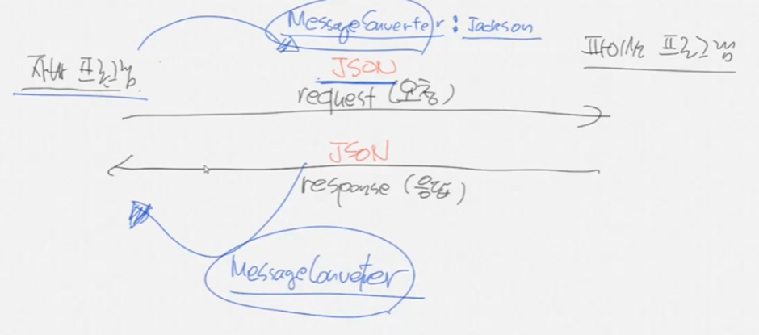

### 스프링부트 개념정리 3강 - 메시지 컨버터가 무엇인가요?

#

### Spring이란

- Framework이다.
- 오픈 소스이다.
- IoC(Inversion of Control, 제어의 역전) 컨테이너를 가진다.
    
    기본적으로 new로 객체를 생성하면 heap영역에 할당된 객체를 생성한 메서드에서 관리
    
    (다른 메서드에서 생성한 객체를 사용하기 어렵다는 단점이 존재)
    
    IoC는 생성한 클래스를 Spring에서 자동으로 객체를 heap 메모리에 할당하여 관리
    
    (모든 메소드에서 동일한 인스턴스 사용 가능 => 싱글톤)
    
- DI(Dependency Injection, 의존성 주입)를 지원한다.
- 엄청나게 많은 필터를 가지고 있다.
    
    톰켓 - 명칭 : 필터(filter) / 톰켓에서 필터 기능을 하는 파일 : web.xml
    
    스프링컨테이너 - 명칭 : 인터셉터(AOP) / 역할 : 권한 확인
    
- 엄청나게 많은 어노테이션을 가지고 있다. (리플렉션, 컴파일체킹)
    
    어노테이션 : 컴파일러가 체크할 수 있게 힌트를 주는 주석
    
    스프링에서는 어노테이션을 통해서 객체를 생성한다. (IoC를 사용하는 기법)
    
    ex) @Compont : 클래스 메모리에 로딩 / @Autowired : 로딩된 객체 해당 변수에 할당
    
    리플렉션 : 클래스의 메서드, 필드, 어노테이션 등을 런타임 시 분석하는 기법
    
- MessageConverter를 가지고 있다. 기본값은 현재 Json이다.
    
    문제 : 서로 다른 언어를 사용 ⇒ 해결방안 : 공통의 중간 언어를 사용(과거 : XML → 현재 : JSON)
    
    과정 예시 : Java Object → JSON → Python Object → JSON → Java Object
    
    JSON 형태 예시 : {”num” : 10, “name” : “사자”}
    
    MessageConverter : 통신 시 자동으로 Java Object를 JSON으로 Converting해준다. (반대도 가능)
    
    기본적으로 Jackson으로 설정되어 있으며, Jackson은 기본 JSON형태로 변경한다.
    
     
    
- BufferedReader와 BufferedWriter를 쉽게 사용할 수 있다.
    
    통신(영어권)
    
    전류는 bit 단위로 통신한다. 영어 한 문자를 표현하기 위해 8bit(256가지 문자)가 필요하다.
    
    따라서 알파벳 한 문자씩 통신으로 송수신하기 위하여 8bit(1byte)씩 끊어서 해석하기로 규약을 만들었다. (1byte는 통신의 최소 단위로 하나의 문자를 표현할 수 있다.)
    
    Byte Stream : 데이터 통신으로 1Byte(8bit)로 통신한다.
    
    인코딩 방식을 각각 따로 쓰면 데이터 통신할 수 없다.  따라서 유니코드 기반의 UTF-8(3byte 통신)을 제공한다. 최근에는 문자 인코딩을 3byte로 한다.
    
     
    
    자바에서 Byte Stream을 받으면 InputStream으로 읽는다. byte 통신을 하고 있으므로 InputStream을 byte 단위로 읽는다. 
    
    byte 단위로 받은 InputStream을 문자 형태로 변환하여 처리해야 한다. 이를 처리해주는 클래스 InputStreamReader가 존재한다. InputStreamReder는 여러 개의 문자를 받을 때 배열을 사용하는 데 배열은 크기가 정해져 있어야 한다. 
    
    크기가 작으면 데이터 정상 송수신이 어렵고 크기가 크면 메모리가 낭비되므로 사용하지 않는다. 
    
     

    결국 BufferedReader로 데이터를 받는다. BufferedReader는 가변길이의 문자를 받을 수 있다.
    
    request 요청 시 데이터를 BufferedReader로 받는다. (JSP에서는 request.getReader()를 사용하면 Buffered Reader의 일을 해준다.)
    
    데이터를 보낼 때도 BufferedWriter를 사용해야 하나 내려쓰기 기능이 없어서 자바에서는 PrintWriter를 사용한다. PrintWriter는 Println()을 지원하여 내려쓰기가 가능하다.
    
    JSP에는 out이라는 내장 객체가 존재한다. out은 BufferedWriter를 사용한다.
    
    BufferedWriter는 통신(Byte Stream)을 통해 데이터를 전송할 때 전송단위가 문자열로 가변길이의 데이터를 사용하게 해주는 클래스이다.
    
     

    BufferedReader와 BufferedWriter를 구현할 필요없이 어노테이션을 지원한다. 
    
    데이터를 받을 때 @RequestBody → BufferedReader가 존재
    
    데이터를 전달할 때 @ResponseBody → BufferedWriter가 존재
    
- 계속 발전중이다.

---

### MessageConverter

- HttpMessageConverter는 인터페이스이며, canRead(), canWrite(), read(), write() 메서드가 존재한다.
    - canRead()와 canWrite()는 메시지 컨버터가 해당 클래스, 미디어 타입을 지원하는지 체크한다.
    - read()와 write()는 메시지 컨버터를 통해서 메시지를 읽거나 쓰는 기능이다.

- HttpMessageConverter 역할
    - 요청의 경우, 메시지를 읽어서 객체로 바꾼 다음 컨트롤러에 파라미터로 넘겨주는 역할을 한다.
    - 응답의 경우, 컨트롤러에서 리턴 값을 가지고 Http 응답 메시지로 넣는 역할을 한다.

- HTTP 요청 데이터 읽는 과정
    1. @RequestBody 또는 HttpEntity 파라미터를 사용한다.
    2. 메시지 컨버터가 메시지를 읽을 수 있는지 확인하기 위하여 canRead()를 호출한다.
        
        (대상의 클래스 타입 지원 여부, Content-Type 미디어 타입 지원 여부 확인)
        
    3. canRead()에서 조건을 모두 만족하면 read()를 호출하여 객체를 반환한다.

- HTTP 응답 데이터 생성 과정
    1. @ReponseBody또는 HttpEntity 파라미터를 사용한다.
    2. 메시지 컨버터가 메시지를 쓸 수 있는지 확인하기 위하여 canWrite()를 호출한다.
        
        (리턴 대상 클래스 타입 지원 여부, HTTP요청의 Accept 미디어 타입 지원 여부 확인)
        
    3. canWrite()에서 조건을 모두 만족하면 write()를 호출하여 HTTP 응답 메시지 바디에 데이터를 생성한다.

- @ResponseBody를 사용하는 경우
    - ViewResolver 대신 HttpMessageConverter가 동작된다.
    - 기본 문자 처리의 경우, StringHttpMessageConverter를 사용한다.
    - 기본 객체 처리의 경우, MappingJackson2 HttpMessageConverter를 사용한다.
    - byte [] 처리 및 기타 여러 가지의 HttpMessageConverter가 기본으로 등록되어 있다.
    
- SpringBoot의 기본 MessageConverter 우선순위
    1. ByteArrayHttpMessageConverter
    2. StringHttpMessageConverter
    3. MappingJackson2HttpMessageConverter

#

### 참조

<a href="https://www.inflearn.com/course/%EC%8A%A4%ED%94%84%EB%A7%81%EB%B6%80%ED%8A%B8-%EA%B0%9C%EB%85%90%EC%A0%95%EB%A6%AC">스프링부트 개념정리(이론)</a> 
<a href="https://hyos-dev-log.tistory.com/18">[Spring] HttpMessageConverter 정리</a> 
