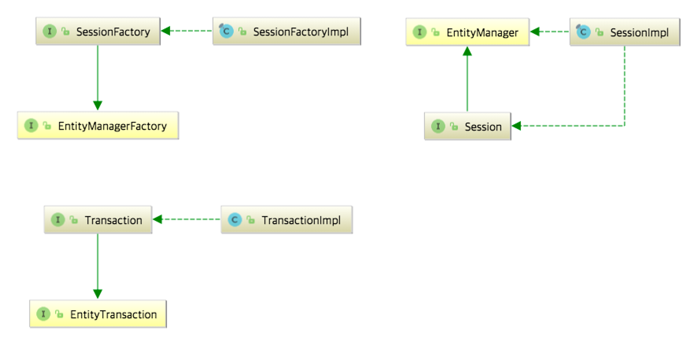
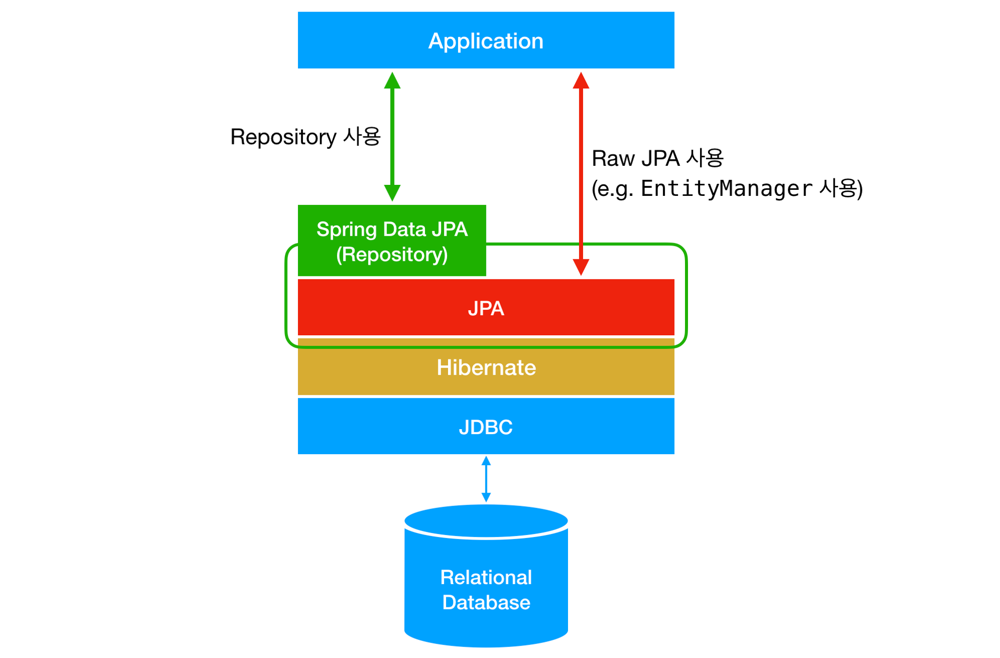
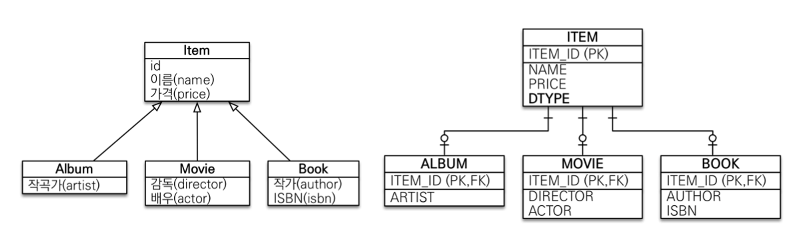
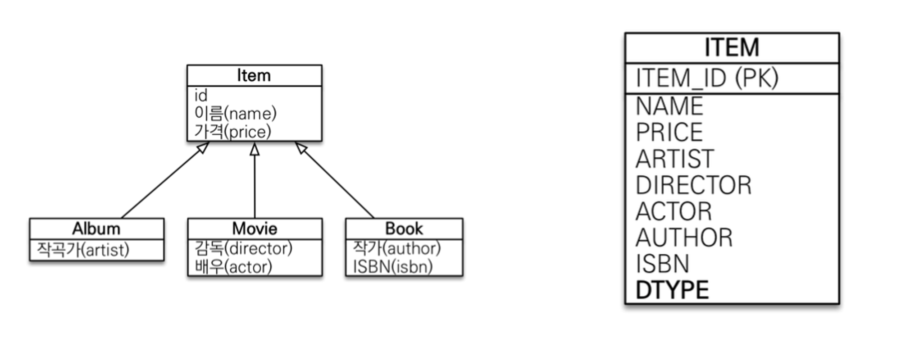
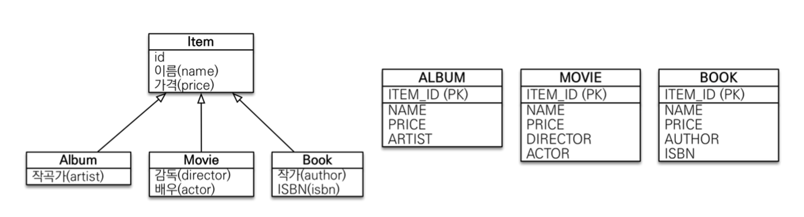

### 스프링부트 개념정리 4강 ~ 7강 정리

#

### 1. JPA vs Spring data JPA

- JPA는 관계형 데이터베이스를 사용하는 방식을 정의한 인터페이스로, ORM 기술 표준이다.
- Spring data JPA는 스프링이 제공하는 프레임워크로, 개발자가 JPA를 편하게 사용할 수 있도록 한다.

- JPA는 인터페이스로, JPA에 핵심이 되는 EntityManager는 interface로 정의되어 있다.
- Hibernate는 JPA interface를 구현한 구현체로, EntityManager와 같은 interface를 직접 구현한 라이브러리이다.
    
    <br>
    
- 위 사진은 JPA와 Hibernate의 상속 및 구현 관계를 나타낸 것이다. JPA의 핵심인 `EntityManagerFactory`, `EntityManager`, `EntityTransaction`을 Hibernate에서는 각각 `SessionFactory`, `Session`, `Transaction`으로 상속받고 각각 `Impl`로 구현하고 있음을 확인할 수 있다.

- Spring Data JPA는 JPA를 한 단계 추상화시킨 Repository interface를 제공한다. Spring Data JPA의 Repository의 구현에서 JPA를 사용한다. `Repository` 인터페이스의 기본 구현체인 `SimpleJpaRepository`의 코드를 보면 아래와 같이 내부적으로 `EntityManager`을 사용하고 있는 것을 볼 수 있다. `Repository` 인터페이스에 정해진 규칙대로 메소드를 입력하면, Spring이 알아서 해당 메소드 이름에 적합한 쿼리를 날리는 구현체를 만들어서 Bean으로 등록해준다.
    
    ```jsx
    package org.springframework.data.jpa.repository.support;
    
    import ...
    
    public class SimpleJpaRepository<T, ID> implements JpaRepositoryImplementation<T, ID> {
    
        private final EntityManager em;
    
        public Optional<T> findById(ID id) {
    
            Assert.notNull(id, ID_MUST_NOT_BE_NULL);
    
            Class<T> domainType = getDomainClass();
    
            if (metadata == null) {
                return Optional.ofNullable(em.find(domainType, id));
            }
    
            LockModeType type = metadata.getLockModeType();
    
            Map<String, Object> hints = getQueryHints().withFetchGraphs(em).asMap();
    
            return Optional.ofNullable(type == null ? em.find(domainType, id, hints) : em.find(domainType, id, type, hints));
        }
    
        // Other methods...
    }
    ```
    
    <br>
    

#

### 참고
<a href="https://suhwan.dev/2019/02/24/jpa-vs-hibernate-vs-spring-data-jpa/">JPA, Hibernate, 그리고 Spring Data JPA의 차이점</a><br>

<a href="https://tape22.tistory.com/30">JPA 구조는 어떻게 되어있고 spring-data-jpa와는 뭐가 다를까?</a><br>

<a href="https://velog.io/@adam2/JPA는-도데체-뭘까-orm-영속성-hibernate-spring-data-jpa#ormobject-relation-mapping객체-관계-매핑">JPA는 도대체 뭘까? (orm, 영속성, hibernate, spring-data-jpa)</a><br>

<br>

### 2. EntityManager

### Entity Manager Factory

- EntityManagerFactory는 JPA에서 EntityManager를 생성하기 위한 인터페이스이다.
    
    EntityManagerFactory 객체가 있어야 Entitymanager를 생성할 수 있다.
    
    ```java
    // 엔티티 매니저 팩토리 생성 코드
    EntityManagerFactory emf = Persistence.createManagerFactory("example");
    ```
    
    - Persistence 클래스는 JPA에서 엔티티 매니저 팩토리를 생성하는 가장 간단한 방법을 제공한다.
    - createManagerFactory(String persistenceInitName)은 persistence.xml 파일에서 정의한 정보를 기반으로 엔티티 매니저 팩토리를 생성한다.
    - persistence.xml은 JPA에서 데이터베이스와의 연결 및 매핑 정보를 정의하는 파일이다.
    - 엔티티 매니저 팩토리는 어플리케이션 전체에서 딱 한 번만 생성하고 공유해서 사용해야 한다. 따라서 보통 애플리케이션 시작 시점에서 엔티티 매니저 팩토리를 생성하고, 애플리케이션 종료 시점에서 close()를 호출하여 닫는다.

### Entity Manager

- EntityManager 생성
    
    ```java
    EntityManagerFactoty emf = Persistence.createManagerFactory("example");
    EntityManager em = emf.createEntityManager();
    ```
    
- JPA의 기능 대부분은 엔티티 매니저가 제공한다. 대표적으로 엔티티 매니저를 사용해서 엔티티를 데이터베이스에 등록/수정/삭제/조회할 수 있다.
- 엔티티 매니저는 내부적으로 데이터베이스와의 커넥션을 관리하며, 트랜잭션 내에서 엔티티를 영속화하고 업데이트하며, 쿼리를 실행한다. 또한, 엔티티의 상태를 추적하고 관리하므로, 엔티티를 영속화할 때 자동으로 데이터베이스에 INSERT쿼리를 실행하거나, 업데이트할 때 자동으로 UPDATE 쿼리를 실행하고 삭제할 때 자동으로 DELETE 쿼리를 실행한다.
- 엔티티 매니저 팩토리는 여러 스레드가 동시에 접근해도 안전하므로 서로 다른 스레드 간에 공유해도 되지만, 엔티티 매니저는 데이터베이스 커넥션과 밀접한 관계가 있어 여러 스레드가 동시에 접근하면 동시성 문제가 발생하므로 스레드 간에 절대 공유하면 안된다.

### Entity Manager가 제공하는 주요 메서드

- 엔티티 관리 메서드
    - persist(Obect entity) : 엔티티를 영속화(저장)
    - merge(Obect entity) : 엔티티를 병합(영속 상태 엔티티를 업데이트)
    - remove(Obect entity) : 엔티티를 삭제
    - find(Class<T> entityClass, Object primaryKey) : 엔티티를 조회
    - getReference(Class<T> entityClass, Object primaryKey) : 엔티티의 참조를 조회
- 쿼리 생성 및 실행 메서드
    - createQuery(String qlString) : JPQL 쿼리를 생성
    - createNamedQuery(String name) : 이름이 지정된 JPQL 쿼리를 생성
    - carateNativeQuery(String sqlString) : 네이티브 SQL 쿼리를 생성
    - createNamedStoredProcedureQuery(String name) : 이름이 지정된 저장 프로시저 쿼리를 생성
- 트랜잭션 관리 메서드
    - getTransaction() : 현재 트랜재션을 획득
    - joinTransaction() : 현재 트랜잭션에 참여
    - flush() : 영속성 컨텍스트의 변경 내용을 데이터베이스에 반영

### 스프링 프레임워크에서 사용하기

- 스프링 프레임워크에서 엔티티 매니저 팩토리르 빈(Bean)으로 등록하여 관리한다. 따라서 스프링의 IoC 컨테이너에서 생성되고 관리되며, 필요한 곳에서 주입받아 사용할 수 있다.
- 스프링에서 제공하는 LocalContainerEntityManagerFactoryBean은 JPA를 사용하는 데 필요한 엔티티 매니저 팩토리를 설정하는데 사용된다. (JavaConfig.java, appConfig.xml 파일로 설정)
- @PersistenceContext 어노테이션은 컨테이너가 관리하는 엔티티 매니저를 주입한다.

### SpringBoot에서 사용하기

- SpringBootdptj JPA를 사용할 때는 엔티티 매니저 팩토리를 생성하고 관리하기 위해 [application.properties](http://application.properties) 또는 application.xml 파일에서 설정한다.
- @PersistenceContext 어노테이션 또는 생성자로 주입한다.

```java
import jakarta.persistence.EntityManager;

public class JpaMemberRepository implements MemberRepository {

	private final EntityManager em;
	
	@Autowired
	public JpaMemberRepository(EntityManager em) {
		this.em = em;
	}
	
	@Override
	public Member save(Member member) {
		em.persist(member);
		return member;
	}
	...
```

#

### 참고
<a href="https://bnzn2426.tistory.com/143">[JPA] EntityManagerFactory & EntityManager</a><br>

<a href="https://www.inflearn.com/questions/158967/안녕하세요-entitymanager에-대해-궁금한-점이-있어-질문-남깁니다">안녕하세요, EntityManager에 대해 궁금한 점이 있어 질문 남깁니다.</a><br>

<br>

### 3. 준영속성

### 엔티티 생명주기

- 비영속(new) 상태 : 영속성 컨텍스트와 관계가 없는 상태
    - 순수한 엔티티 객체 상태로 아직 저장하지 않아 영속성 컨텍스트나 데이터베이스와 관계가 없다.
    
    ```java
    // 객체를 생성한 상태 (비영속)
    Member member = new Member();
    member.setId("member1");
    member.setUsername("회원1");
    ```
    
- 영속(managed) 상태 : 영속성 켄텍스트에 저장된 상태
    - 엔티티 매니저를 통해 엔티티를 영속성 컨텍스트에 저장한 상태로, 영속성 컨텍스트에 의해 관리된다.
    
    ```java
    //객체를 지정한 상태(영속)
    em.persist(member);
    ```
    
- 준영속(detached) 상태 : 영속성 컨텍스트에 저장되었다가 분리된 상태
    - 영속성 컨텍스트가 관리하던 영속 상태의 엔티티를 영속성 컨텍스트가 관리하지 않으면 준영속 상태가 된다.
    - 준영속 상태로 전환 시, 1차 캐시, 쓰기지연 저장소에 저장된 정보들이 모두 삭제된다.
    - 영속 상태가 아니게 되므로, 1차 캐시, 쓰기 지연, 변경 감지, 지연 로딩을 포함한 영속성 컨텍스트가 제공하는 어떠한 기능도 동작하지 않는다.
    
    - em.detach()는 준영속 상태를 명시적으로 호출한다.
    - em.clear()를 통해 영속성 컨텍스트 내의 모든 엔티티를 지워버림으로써 준영속 상태로 만들 수 있다.
    - em.close()를 통해 영속성 컨텍스트를 종료해버림으로써 준영속 상태로 만들 수 있다.
    
    ```java
    // 회원 엔티티를 영속성 컨텍스트에서 분리, 준영속 상태
    em.detach(member);
    ```
    
    - 비영속 상태와 별 다를것 없지만, 영속성 컨텍스트에 들어갔었으므로 실존하는 데이터라는게 증명된다.
- 삭제(removed) 상태 : 삭제된 상태
    - 엔티티를 영속성 컨텍스트와 데이터베이스에서 삭제한다.

#

### 참고
<a href="https://joont92.github.io/jpa/영속성-관리/">[jpa] 영속성 관리</a><br>

<a href="https://ultrakain.gitbooks.io/jpa/content/chapter3/chapter3.3.html">3.3 엔티티의 생명주기</a><br>

<br>

### 4. JPA 상속

- 상속 관계 매핑
    - 객체지향에는 상속 관계가 존재하지만, 관계형 데이터베이스는 상속관계를 지원하지 않는다.
    - 대신, 데이터베이스의 슈퍼타입, 서브타입 관계라는 모델링 기법을 통해 객체의 상속 관계를 매핑할 수 있다.
    
- 슈퍼 - 서브 타입 관계
    - 공통적인 부분과 그 외 부분들로 나누는 방법이다.
    - 슈퍼타입 : 공통 속성 / 서브타입 : 다른 엔티티와 차이가 있는 속성

- 슈퍼 - 서브 타입 구현 방법 (3가지)
    - 주요 어노테이션 : `@Inheritance(strategy = InheritanceType.XXX)`
        
        (JOINED : 조인 전략 / SINGLE_TABLE: 단일 테이블 전략 / TABLE_PER_CLASS: 구현 클래스마다 테이블 전략)
        
    1. 조인 전략
        - 슈퍼타입, 서브타입 논리모델을 각각 테이블로 옮긴 방식이다. 테이블이 구분되어 있기 때문에 데이터를 조회할 때 조인이 필요하여 조인 전략이라고 한다.
            
            <br>
            
            ```java
            // 슈퍼타입
            @Entity
            @Getter @Setter
            @Inheritance(strategy = InheritanceType.JOINED)
            @DiscriminatorColumn
            public abstract class Item {
            
                @Id @GeneratedValue
                @Column(name = "ITEM_ID")
                private Long id;
            
                private String name;
                private int price;
            }
            ```
            
            ```java
            // 서브타입
            @Entity
            @Getter @Setter
            @DiscriminatorValue("A")
            public class Album extends Item {
            
                private String artist;
            }
            ```
            
            - 슈퍼타입 Item 엔티티는 `@Inheritance(strategy = InheritanceType.JOINED)` 을 통해 매핑전략을 조인 전략으로 지정했다.
            - `@DiscriminatorColumn` 어노테이션은 구분자 컬럼이다. 조인 전략과 단일 테이블 전략에서는 구분자 컬럼이 필수이다. 구분자 컬럼을 통해 어떤 서브타입의 데이터인지 구분한다. 구분자 컬럼이 필요할 때 생략하면 자동으로 추가하지만 명시적으로 적어주는것을 추천한다. 구분자 컬럼의 이름은 기본값으로 "DTYPE" 이다. 사용자가 원하는 값으로 지정해줄 수 있지만 특별한 이유가 없다면 기본값을 그대로 쓰는것을 추천한다.
            - 서브타입 Album은 슈퍼타입 Item을 상속받는다. `@DiscriminatorValue`를 통해 구분자 컬럼의 값을 정할 수 있다. 기본값은 엔티티 이름이다.
        - 장점
            - 테이블이 정규화 된다.
            - 외래키 참조 무결성 제약조건을 활용할 수 있다.
            - 저장공간이 효율화된다.
        - 단점
            - 조회시 조인이 필요하다. 조인이 필요하기 때문에 단일 테이블 전략에 비해 성능이 떨어질 수 있다.
            - 조인이 필요하기 때문에 단일 테이블 전략에 비해 조회 쿼리가 복잡하다.
            - 테이블이 나뉘어져 있기 때문에 저장시 INSERT SQL이 2번 호출된다. 단일 테이블 전략에 비해 성능이 떨어진다.
            
    2. 단일 테이블 전략
        - 하나의 테이블에 모든 데이터를 몰아넣는 전략으로, 서브타입을 구별하기 위해 구분자 컬럼이 필수이다.
            
            <br>
            
            ```java
            @Entity
            @Getter @Setter
            @Inheritance(strategy = InheritanceType.SINGLE_TABLE)
            @DiscriminatorColumn
            public abstract class Item {
            
                @Id @GeneratedValue
                @Column(name = "ITEM_ID")
                private Long id;
            
                private String name;
                private int price;
            }
            ```
            
            ```java
            @Entity
            @Getter @Setter
            @DiscriminatorValue("A")
            public class Album extends Item {
            
                private String artist;
            }
            ```
            
            - 조인 전략에서 `@Inheritance(strategy = InheritanceType.SINGLE_TABLE)` 을 통해 전략을 바꾼 것 외에는 다른 코드는 없다.
        - 장점
            - 조인이 필요 없기 때문에 일반적인 상황에서 조회 성능이 빠르다.
            - 조인이 필요 없기 때문에 조회 쿼리가 단순하다.
        - 단점
            - 자식 엔티티에 매핑한 컬럼은 모두 null을 허용해야한다.
            - 테이블의 컬럼 길이가 커지기 때문에 상황에 따라 조회 성능이 오히려 느려질 수 있다.
            
    3. 구현 클래스마다 테이블 전략
        - 슈퍼타입은 테이블로 매핑하지 않고 서브타입만 테이블로 매핑한느 방법이다.
        - 실무에서 사용 불가능하며, 개념적으로 물품(Item)이라는 슈퍼타입에 종속되어 있는 각각의 서브타입 테이블들을 통합해서 관리하기 어렵다.
            
            <br>
            
            ```java
            @Entity
            @Getter @Setter
            @Inheritance(strategy = InheritanceType.TABLE_PER_CLASS)
            @DiscriminatorColumn
            public abstract class Item {
            
                @Id @GeneratedValue
                @Column(name = "ITEM_ID")
                private Long id;
            
                private String name;
                private int price;
            }
            ```
            
            ```java
            @Entity
            @Getter @Setter
            @DiscriminatorValue("A")
            public class Album extends Item {
            
                private String artist;
            }
            ```
            
            - 조인 전략에서 `@Inheritance(strategy = InheritanceType.TABLE_PER_CLASS)` 을 통해 전략을 바꾼 것 외에는 다른 코드는 없다.
        - 장점
            - 서브타입만 명확하게 구분해서 처리할 수 있다.
            - 단일 테이블 전략에서는 불가능한 not null 제약조건을 사용할 수 있다.
        - 단점
            - 여러 자식 테이블을 함께 조회할 때 성능이 매우 느리다. (UNION 연산 발생)
            - 자식 테이블을 통합해서 쿼리하기 어렵다.

#

### 참고
<a href="https://velog.io/@imcool2551/JPA-상속관계-매핑">[JPA] 상속관계 매핑</a><br>

<br>

### 5. Filter

**Filter / Interceptor / AOP**

Filter

- 요청과 응답을 거른 뒤 정제하는 역할 수행하며, Dispatcher Servlet에 요청이 전달되기 전/후에 url 패턴에 맞는 모든 요청에 대해 부가 작업을 처리할 수 있는 기능을 제공한다.
- Dispatcher Servlet은 스프링의 가장 앞단에 존재하는 프론트 컨트롤러이므로, 필터는 스프링 범위 밖(웹 컨테이너 ex) 톰켓)에서 처리된다. (스프링 빈으로 등록 가능)
- 보통 web.xml에 등록하고, 일반적으로 인코딩 변환 처리, XSS방어 등의 요청에 대한 처리로 사용된다.
- Filter의 메소드 종류Filter를 사용하기 위해서는 javax.servlet의 Filter 인터페이스를 구현(implements)해야 하며, 다음과 같은 3가지 메소드를 가진다.
    
    ```java
    public interface Filter {
    
        public default void init(FilterConfig filterConfig) throws ServletException {}
    
        public void doFilter(ServletRequest request, ServletResponse response, FilterChain chain) throws IOException, ServletException;
    
        public default void destroy() {}
    }
    
    ```
    
    1. init()Filter 객체를 초기화하고 서비스에 추가하기 위한 메소드이다.웹 컨테이너가 1회 init()을 호풀하여 필터 객체를 초기화하면 이후 요청들은 doFilter()를 통해 처리된다.
    2. doFilter()url-pattern에 맞는 모든 HTTP 요청이 디스패처 서블릿으로 전달되기 전에 웹 컨테이너에 의해 실행되는 메소드이다.doFilter의 파라미터로 FilterChain이 있는데, FilterChain의 doFilter를 통해 다음 대상으로 요청을 전달할 수 있게 된다.chain.doFilter()로 전/후에 필요한 처리 과정을 추가하여 원하는 처리를 진행할 수 있다.
    3. destroy()필터 객체를 제거하고 사용하는 자원을 반환하기 위한 메소드이다.웹 컨테이너가 1회 destroy()를 호출하여 필터 객체를 종료하면 이후에는 doFilter에 의해 처리되지 않는다.

Interceptor

- Spring이 제공하는 기술로, Dispatcher Servlet이 컨트롤러를 호출하기 전/후에 요청과 응답을 참조하거나 가공할 수 있는 기능을 제공한다. (스프링 컨텍스트에서 동작)
- Interceptor의 메소드 종류인터셉터를 추가하기 위해서는 org.springframework.web.servlet의 HandlerInterceptor 인터페이스를 구현(implements)해야 하며, 다음과 같은 3가지 메소드를 가진다.
    
    ```java
    public interface HandlerInterceptor {
    
        default boolean preHandle(HttpServletRequest request, HttpServletResponse response, Object handler) throws Exception {
        return true;
        }
    
        default void postHandle(HttpServletRequest request, HttpServletResponse response, Object handler, @Nullable ModelAndView modelAndView) throws Exception {}
    
        default void afterCompletion(HttpServletRequest request, HttpServletResponse response, Object handler, @Nullable Exception ex) throws Exception {}
    }
    
    ```
    
    1. PreHandle()Controller가 호출되기 전에 실행된다.컨트롤러 이전에 처리해야 하는 전처리 작업이나 요청 정보를 가공, 추가하는 경우에 사용할 수 있다.
    2. postHandle()Controller가 호출된 후에 실행된다.(View 렌더링 전)컨트롤러 이후에 처리해야 하는 후처리 작업이 있을 때 사용하 수 있다.(컨트롤러가 반환하는 ModelAndView 타입의 정보가 제공되나, 최근에는 JSON 형태로 데이터를 제공하는 RestAPI 기반의 컨트롤러(@RestController)를 만들면서 자주 사용되지 않는다.)
    3. afterCompletion()모든 뷰에서 최종 결과를 생성하는 일을 포함해 모든 작업이 완료된 후에 실행된다.(View 렌더링 후)요청 처리 중에 사용한 리소스를 반환할 때 사용할 수 있다.

AOP(Aspect Oriented Programming, 관점 지향 프로그래밍)

- 부가 기능을 핵심 기능에서 분리해 한 곳으로 관리하도록 하고, 이 부가 기능을 어디에 적용할지 선택하는 기능을 합한 하나의 모듈

참고 - Interceptor 대신 컨트롤러에 적용할 부가기능을 어드바이스로 만들어 AOP를 적용할 수도 있으나, 다음과 같은 이류로 컨트롤러의 호출 과정에 적용되는 부가 기능들은 Interceptor를 사용하는 편이 낫다.

1. 컨트롤러는 타입과 실행 메소드가 모두 제각각이라 포인트컷(적용할 메소드 선별)의 작성이 어렵다.
2. 컨트롤러는 파라미터나 리턴 값이 일정하지 않다.

**Filter와 Interceptor 정리**

<br>

- Filter와 Interceptor 모두 비즈니스 로직과 분리되어 특정 요구사항(보안, 인증, 인코딩 등)을 만족시켜야 할 때 적용한다.
- Filter는 특정 요청과 컨트롤러에 관계없이 전역적으로 처리해야 하는 작업이나 웹 어플리케이션에 전반적으로 사용되는 기능을 구현할 때 적용한다.
- Interceptor는 클라이언트의 요청과 관련된 작업에 대해 추가적인 요구하상을 만족해야 할 때 적용한다.

#

### 참고
<a href="https://dev-coco.tistory.com/173">[Spring] 필터(Filter)와 인터셉터(Interceptor)의 개념 및 차이</a><br>

<a href="https://mangkyu.tistory.com/173">[Spring] 필터(Filter) vs 인터셉터(Interceptor) 차이 및 용도 - (1)</a><br>