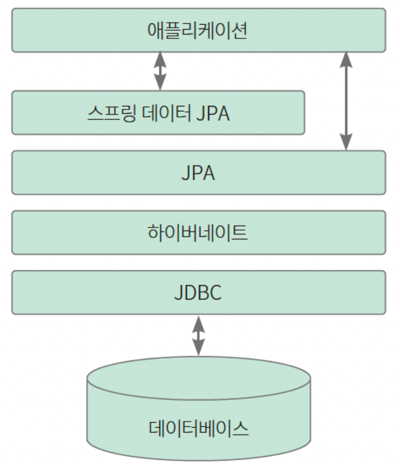

### 스프링부트 개념정리 4강 - JPA란 무엇인가요?

#

### JPA란

- JPA는 Java Persistence API 이다.
    - Persistence(영속성) : 데이터를 생성한 프로그램의 실행이 종료되더라도 사라지지 않는 데이터의 특성을 의미한다.
    - JPA : 자바에 있는 데이터를 DB(영구)에 기록할 수 있는 환경을 제공하는 API이다.
    - API(Application programming interface) : 정의 및 프로토콜 집합을 사용하여 두 소프트웨어의 구성 요소가 서로 통신할 수 있게 하는 규칙
    - 프로토콜과 인터페이스 차이 (모두 규칙이다.)
        
        인터페이스 : 한 사람이 규칙(인터페이스)을 정하면 사용하는 사람은 규칙(인터페이스)을 따라야 한다. (상하관계가 존재하는 약속)
        
        프로토콜 : 서로 동등한 관계의 약속이다. 모두 동의할 수 있는 규칙(프로토콜)을 사용한다.
        
    - (정리) JPA는 JAVA 프로그래밍을 할 때 영구적으로 데이터를 저장하기 위해 필요한 인터페이스이다.
- JPA는 ORM 기술이다.
- JPA는 반복적인 CRUD 작업을 생략하게 해준다.
- JPA는 영속성 컨텍스트를 가지고 있다.
- JPA는 DB와 OOP의 불일치성을 해결하기 위한 방법론을 제공한다. (DB는 객체저장 불가능)
- JPA는 OOP의 관점에서 모델링을 할 수 있게 해준다. (상속, 콤포지션, 연관관계)
- 방언 처리가 용이하여 Migration하기 좋다. (유지보수에도 좋다.)
- JPA는 쉽지만 어렵다.

#

### JPA(Java Persistence API)

- 스프링부트는 JPA를 ORM(Object-Relational Mapping) 기술의 표준으로 사용하여 데이터베이스를 관리한다.
- JPA는 관계형 데이터베이스를 사용하는 방식을 정의한 인터페이스 모음이므로, 인터페이스를 구현한 실제 클래스가 필요하다. JPA를 구현한 실제 클래스에는 대표적으로 하이버네이트(Hibernate)가 있다.
    
    <br>

### ORM(Object-Relational Mapping)

- 자바의 객체와 데이터베이스를 연결하는 프로그래밍 기법이다.
- 객체와 데이터베이스를 연결하여 자바 언어로만 데이터베이스를 다룰 수 있게 하는 도구이다.

### JPA의 특징

- 엔티티 매니저(entity manager)
- 영속성 컨텍스트

### JPA의 엔티티 매니저

- 엔티티(entity) : 데이터베이스의 테이블과 매핑되는 객체이다. 엔티티는 본질적으로 자바의 객체이므로 일반 객체와 다르지 않으나, 데이터베이스의 테이블과 직접 연결된다는 특징이 있어 구분지어 부른다. 따라서 엔티티는 데이터베이스에 영향을 미치는 쿼리를 실행하는 객체이다.
- 엔티티 매니저(entity manager) : 엔티티를 관리해 데이터베이스와 애클리케이션 사이에서 객체를 생성, 수정, 삭제하는 등의 역할을 한다. 엔티티 매니저는 엔티티 매니저 팩토리(entity manager factory)에서 생성된다.

- 스프링부트는 내부에서 엔티티 매니저 팩토리를 하나만 생성해서 관리하고 @PersistenceContext 또는 @AutoWired 어노테이션을 사용하여 엔티티 매니저를 사용한다. 스프링 부트는 기본적으로 빈은 하나만 생성하여 공유하므로, 동시성 문제가 발생할 수 있어 실제 엔티티 매니저가 아닌 실제 엔티티 매니저와 연결하는 프록시 엔티티 매니저를 사용한다.
    
    ```java
    @persistenceContext
    EntityManager em; // 프록시 엔티티 매니저로, 필요할 때 진짜 엔티티 매니저를 호출한다.
    ```
    

### 스프링 데이터(Spring Data)

- 데이터베이스의 특수한 특성을 유지하며 데이터 접근을 위한 친숙하고 일관된 Spring 기반의 프로그래밍 모델을 제공한다.
- 스프링 데이터는 데이터베이스에 접근하여 데이터를 가져오는 일과 가져온 데이터를 처리하는 일에 통일성과 규칙성을 부여한다.
- 데이터를 가져오는 부분을 Repository 영역이 담당하도록 강제하여 데이터를 가공하는 Service 영역과 분리되도록 한다.
- 따라서 스프링 데이터는 비즈니스 로직과 데이터 로직을 분리하여 결합도는 낮추고, 응집도를 높이도록 도와준다.

### 스프링 데이터 JPA

- 스프링 데이터 JPA는 스프링 데이터의 공통적인 기능에 JPA의 유용한 기술이 추가되었다.
- 스프링 데이터의 인터페이스인 PagingAndSortingRepository를 상속받아 JpaRepository 인터페이스를 만들었으며, JPA를 더 편리하게 사용하는 메서드를 제공한다.
- 스프링 데이터 JPA를 사용하려면 리포지터리 역할을 하는 인터페이스를 만들어 데이터베이스의 테이블 조회, 수정, 생성, 삭제 같은 작업을 간단하게 할 수 있다. JpaRepository 인터페이스를 리포지터리 인터페이스에서 상속받고, 제네릭에는 관리할 <엔티티 이름, 엔티티 기본 키의 타입>을 입력하면 기본 CRUD 메서드를 사용할 수 있다.
    
    ```java
    // 기본 CRUD 메서드를 사용하기 위한 JpaRepository 상속 예시
    public interface MemberRepository extends JpaRepository<Member, Long> {
    }
    ```
    
    ```java
    // 스프링 데이터 JPA에서 제공하는 메서드 사용 예시
    
    @Service
    public class MemberService {
    	@AutoWired // 엔티티 매니저
    	MemberRepository memberRepository;
    	
    	public void test() {
    		// save() 메서드를 호출하여 데이터 객체를 저장한다.
    		memberRepository.save(new Member(1L, "A"));
    		
    		// findById() 메서드에 id를 지정해 엔티티를 하나 조회한다.
    		// findAll() 메서드는 전체 엔티티를 조회한다.
    		Optional<Member> member = memberRepository.findById(1L);
    		List<Member> allMembers = memberRepository.findAll();
    		
    		// deleteById() 메서드에 id를 지정하면 엔티티를 삭제한다.
    		memberRepository.deleteById(1L);
    	}
    }
    ```
    

#

### 참조
<a href="https://www.inflearn.com/course/%EC%8A%A4%ED%94%84%EB%A7%81%EB%B6%80%ED%8A%B8-%EA%B0%9C%EB%85%90%EC%A0%95%EB%A6%AC">스프링부트 개념정리(이론)</a><br>
<a href="https://yozm.wishket.com/magazine/detail/2160/">스프링 데이터 JPA, 5분 만에 알아보기</a><br>
<a href="https://imbf.github.io/spring/2020/04/30/Spring-Data.html">Spring Data란 무엇인가?</a><br>
<a href="https://7772-development.tistory.com/54">Spring Data 분석하기 - 1편 소개</a><br>
<a href="https://wikidocs.net/160890">2-03 JPA로 데이터베이스 사용하기</a><br>
