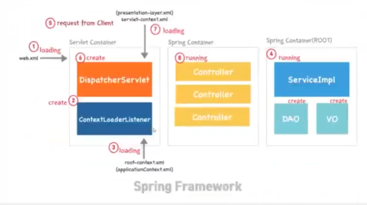
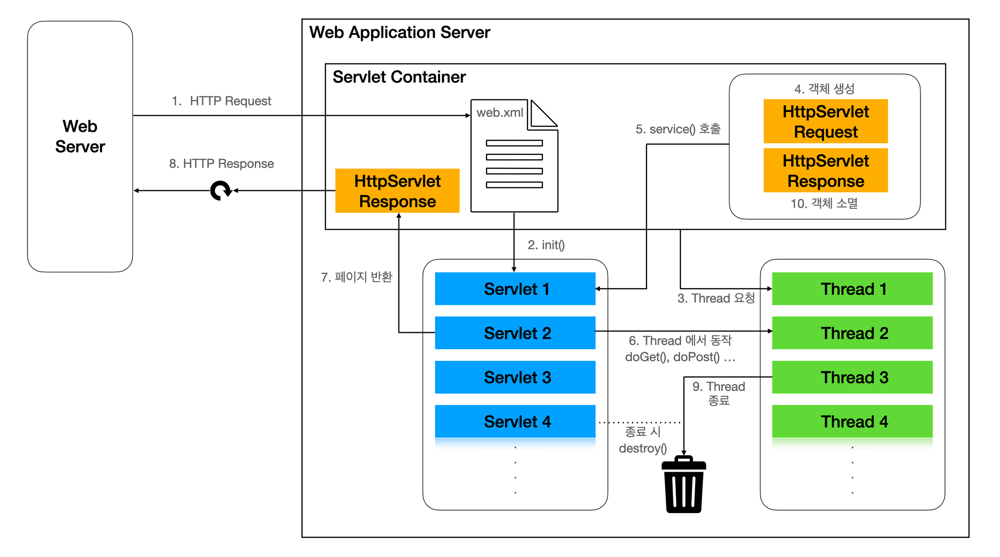

# 스프링부트 개념정리 8**강 ~ 14강 정리**


<br>

### 스프링 웹 애플리케이션의 시작 과정

1. **Tomcat 서버 시작**
    - Tomcat 서버가 시작되면, `web.xml` 파일을 읽는다.
    - `web.xml` 파일에 정의된 `ContextLoaderListener`가 초기화된다.
    - `ContextLoaderListener`는 `root-applicationContext.xml` 파일을 읽어 `root-applicationContext`를 생성하고, DB 연결 등의 공통적인 빈을 메모리에 로드한다.

### 클라이언트 요청 처리 과정

1. **DispatcherServlet 초기화**
    - 클라이언트 요청이 들어오면, `web.xml`에 정의된 `DispatcherServlet`이 요청을 처리한다.
    - `DispatcherServlet`이 초기화될 때 `init()` 메서드가 호출되며, 이 과정에서 `servlet-applicationContext`가 로드된다.
    - `servlet-applicationContext`는 `root-applicationContext`를 부모 컨텍스트로 참조한다.
2. **HTTP 요청 처리**
    - Tomcat은 새로운 스레드를 생성하고, `HttpServletRequest` 및 `HttpServletResponse` 객체를 생성한다.
    - 새로운 스레드가 `DispatcherServlet`의 `doService()` 메서드를 호출한다.
    - `doService()` 메서드는 내부적으로 `doDispatch()` 메서드를 호출하여 실제 요청을 처리한다.
3. **doDispatch() 메서드 - 프론트 컨트롤러 역할**
    - `doDispatch()` 메서드는 프론트 컨트롤러로서 다음과 같은 역할을 수행한다.
        - 요청 URI를 파싱하여 적절한 컨트롤러를 찾는다.
        - 요청 파라미터를 `paramMap`에 담는다.
        - 적절한 컨트롤러의 `process()` 메서드를 호출하여 비즈니스 로직을 수행하고, 결과를 `model`에 담는다.
        - `viewName`을 반환받아 `viewResolver`를 통해 실제 뷰 경로를 결정한다.
        - `MyView` 객체를 생성하여 뷰를 렌더링한다.
4. **뷰 렌더링**
    - `MyView` 객체는 `render()` 메서드를 호출하여 뷰를 렌더링한다.
    - `model`의 데이터를 `HttpServletRequest`에 저장하고, `RequestDispatcher`를 통해 뷰 페이지로 포워딩한다.
- **정리**
    
    프론트 컨트롤러는 클라이언트의 요청을 받아서 request 서블릿의 파라미터를 파싱해주고, 개별 컨트롤러에게 비즈니스 로직을 수행하여 model에 값을 담게 했다. 그리고 개별 컨트롤러에서 반환해준 viewName을 통해 MyView라는 객체를 생성하여 렌더링을 한다. 프론트 컨트롤러가 반환해준 MyView 객체는 HtppServletRequest, HttpServletResponse를 사용한다. 프론트 컨트롤러가 이미 개별 컨트롤러에서 받아온 model에 담겨있는 값을 request 서블릿에 저장하고 Dispatcher를 통해 사용자가 요청한 viewPath로 포워딩 해주는 역할을 한다.
    
    ```java
    public class MyView {
        private String viewPath;
    
        public MyView(String viewPath){
            this.viewPath = viewPath;
        }
    
        public void render(Map<String, Object> model, HttpServletRequest request, HttpServletResponse response) throws ServletException, IOException{
            modelToRequestAttribute(model, request);
            RequestDispatcher dispatcher = request.getRequestDispatcher(viewPath);
            dispatcher.forward(request, response);
        }
    
        private void modelToRequestAttribute(Map<String, Object> model, HttpServletRequest request) {
            model.forEach((key, value) -> request.setAttribute(key, value));
        }
    }
    ```
    

### 뷰 렌더링 과정에서의 모델 데이터 처리

1. **모델 데이터 저장**
    - `MyView` 클래스의 `render()` 메서드는 `modelToRequestAttribute()` 메서드를 통해 `model`의 데이터를 `HttpServletRequest` 객체에 저장한다.
    - 이는 모델에 담긴 데이터를 request 속성으로 설정하는 것입니다. 즉, `model`에 있는 모든 키-값 쌍을 `HttpServletRequest`에 속성으로 추가한다.
2. **뷰 페이지 포워딩**
    - 이후 `RequestDispatcher`를 사용하여 클라이언트가 요청한 뷰 페이지로 포워딩한다.
    - `RequestDispatcher`의 `forward()` 메서드는 서버 측에서 내부적으로 요청을 다른 리소스(예: JSP 페이지)로 전달한다.
    - 이때 `HttpServletRequest` 객체는 원래의 요청 정보와 모델 데이터를 포함하여 뷰 페이지로 전달된다.
3. **클라이언트 응답**
    - 뷰 페이지(JSP 등)는 `HttpServletRequest`에 저장된 모델 데이터를 이용하여 응답 페이지를 생성한다.
    - 최종적으로, 생성된 HTML 페이지가 `HttpServletResponse`를 통해 클라이언트에게 반환된다.

### 요약

- **모델 데이터 저장**: `model`의 데이터는 `HttpServletRequest` 객체에 저장된다.
- **포워딩**: `RequestDispatcher`를 통해 뷰 페이지로 포워딩되며, 이 과정에서 `HttpServletRequest` 객체에 저장된 모델 데이터를 뷰 페이지에서 사용할 수 있다.
- **응답 반환**: 뷰 페이지는 `HttpServletRequest`에서 모델 데이터를 읽어 HTML 페이지를 생성하고, `HttpServletResponse`를 통해 클라이언트에게 최종 응답을 반환한다.

### **Servlet Container의 동작방식**

<br>

### Front Controller 역할


### **DispatcherServlet 라이프 사이클**


1. initStrategies() - 기본 세팅
    
    DispatcherServlet을 기본 세팅하는 과정이다.
    
2. doService() - 실행 준비
    
    FrameworkServlet의 메소드를 오버라이드한 것으로, HttpServlet의 service()와 기능은 동일하나, 독자적인 메소드이다. 즉, HttpServlet에 의존하지 않는다. (FrameworkServlet은 HttpServlet을 상속/구현 한다. 하지만 DispatcherServlet은 service()가 아닌 독자적인 doService()를 사용한다.)
    
    DispatcherServlet의 request 속성을 설정하며, doDispatch()를 실행한다.
    
3. doDispatch() - 실제 실행
    
    프론트 컨트롤러 역할을 수행하여 요청을 적절한 컨트롤러로 라우팅하고, 뷰를 렌더링한다.
    
4. destroy()
    
    `DispatcherServlet`도 스프링 빈으로 등록되므로, 애플리케이션 종료 시 스프링에 의해 빈이 폐기된다.
    

### **Tomcat, Spring MVC의 동작 과정**


- **Tomcat**
    
    ‘WAS(Web Application Server)’의 대표적인 미들웨어 서비스로, 대표적인 미들웨어인 아파치(Apache)의 기능 일부분을 가져와 함께 사용되면서 웹서버(Web Server)의 기능과 웹 애플리케이션 서버(Web Application Server) 모두를 포함하고 있다.
    
- **Servlet container**
    
    톰캣의 메인 기능으로, 서블릿의 로드, 초기화, 호출, 소멸까지의 라이프사이클을 직접적으로 관리해주는 역할을 한다. 서블릿으로 구현된 DispatcherServlet 역시 서블릿 컨테이너에서 수행된다. 서블릿 컨테이너는 웹서버와 통신을 통해 클라이언트의 request를 전달받아 동적 서비스를 response를 해야하는데, 해당 통신을 위해 소켓을 만드는등의 역할을 진행한다. 클라이언트로부터 request를 받을때마다 쓰레드를 생성해 요청을 처리한다.
    
- **Spring container**
    
    `DispatcherServlet` 내부에 `Servlet WebApplicationContext`와 `Root WebApplicationContext`가 동작하는것으로 보이지만 이 두 ApplicationContext가 바로 process 그림에서 보셨던 Spring container에서 동작하는 컨텍스트라고 이해해주시면 될 것 같습니다. 스프링컨테이너는 Java object인 `빈`(Bean)의 라이프 사이클 관리하여 Spring 프레임워크의 특징인 `IOC(제어역전)`와 `DI(의존성주입)`을 제공해주는 역할을 한다.
    

### **Servlet container와 Spring container 차이**

### 서블릿 컨테이너 (Servlet Container)

1. **기능**
    - **HTTP 요청/응답 처리**: HTTP 요청을 받아서 서블릿으로 라우팅하고, 서블릿의 응답을 클라이언트에게 전달하는 역할을 합니다.
    - **서블릿 생명주기 관리**: 서블릿의 생성, 초기화, 서비스 제공, 소멸 등을 관리합니다.
    - **웹 애플리케이션 관리**: 웹 애플리케이션의 배포, 세션 관리, 보안 설정 등을 처리합니다.
2. **대표적 구현체**
    - Apache Tomcat, Jetty, WildFly, GlassFish 등.
3. **주요 목적**
    - 웹 서버로서 HTTP 프로토콜을 기반으로 클라이언트 요청을 처리하고, 서블릿을 통해 동적 웹 콘텐츠를 생성하여 응답합니다.
    - JSP, 서블릿, 필터 등의 자원을 관리하고 실행합니다.
4. **기술 스택**
    - Java EE (Java Platform, Enterprise Edition) 사양의 일부로, 서블릿 API, JSP API 등을 포함합니다.

### 스프링 컨테이너 (Spring Container)

1. **기능**
    - **빈 관리**: 스프링 빈의 생성, 초기화, 의존성 주입, 생명주기 관리 등을 담당합니다.
    - **의존성 주입(DI)**: 스프링의 핵심 기능으로, 빈 간의 의존성을 자동으로 주입하여 결합도를 낮추고 유연성을 높입니다.
    - **애플리케이션 컨텍스트**: 애플리케이션 구성 정보를 제공하고 빈을 관리하는 중앙 저장소 역할을 합니다.
    - **AOP (Aspect-Oriented Programming)**: 애플리케이션의 횡단 관심사를 모듈화하여 코드의 중복을 줄이고 유지 보수성을 향상시킵니다.
    - **트랜잭션 관리**: 선언적 트랜잭션 관리 기능을 제공하여 데이터베이스 작업의 일관성과 안정성을 보장합니다.
2. **대표적 구현체**
    - `BeanFactory`, `ApplicationContext` (예: `ClassPathXmlApplicationContext`, `AnnotationConfigApplicationContext` 등)
3. **주요 목적**
    - 애플리케이션의 비즈니스 로직을 구성하고 관리하는 데 중점을 둡니다.
    - 다양한 설정 방식(XML, Java 애노테이션, Java 코드)으로 유연한 애플리케이션 구성을 지원합니다.
4. **기술 스택**
    - Spring Framework의 일부로, DI 컨테이너, AOP, 트랜잭션 관리, 데이터 접근 기술, 웹 MVC 등을 포함합니다.

### 차이점 요약

1. **기능 및 역할**
    - **서블릿 컨테이너**: HTTP 요청과 응답을 처리하고, 서블릿 생명주기를 관리합니다. 웹 애플리케이션을 배포하고 실행하는 데 주로 사용됩니다.
    - **스프링 컨테이너**: 애플리케이션의 비즈니스 로직을 구성하고 관리하며, DI 및 AOP를 통해 유연하고 모듈화된 애플리케이션을 구성합니다.
2. **범위**
    - **서블릿 컨테이너**: 웹 애플리케이션에 특화되어 있으며, HTTP 프로토콜을 중심으로 작동합니다.
    - **스프링 컨테이너**: 웹 애플리케이션뿐만 아니라 다양한 종류의 자바 애플리케이션(데스크탑, 배치, 클라우드 등)을 관리할 수 있습니다.
3. **종속성**
    - **서블릿 컨테이너**: 스프링 컨테이너 없이도 단독으로 실행될 수 있으며, 서블릿 및 JSP와 같은 웹 구성 요소를 직접 실행합니다.
    - **스프링 컨테이너**: 종종 서블릿 컨테이너 내에서 실행되며, 웹 애플리케이션의 구성 요소를 관리하기 위해 서블릿 컨테이너와 협력합니다.
4. **생명주기 관리**
    - **서블릿 컨테이너**: 서블릿 및 필터의 생명주기를 관리합니다.
    - **스프링 컨테이너**: 스프링 빈의 생명주기를 관리하고, 의존성 주입을 통해 빈 간의 관계를 설정합니다.

### 통합 사용 예

- 스프링 애플리케이션은 일반적으로 서블릿 컨테이너 내에서 실행됩니다. 예를 들어, `DispatcherServlet`은 서블릿 컨테이너에 의해 관리되며, 내부적으로 스프링 컨테이너(`ApplicationContext`)를 사용하여 웹 요청을 처리하고 비즈니스 로직을 실행합니다.

이렇게 두 컨테이너는 역할이 다르지만 상호 보완적으로 작동하여 강력하고 유연한 자바 웹 애플리케이션을 개발할 수 있게 해줍니다.

#

### 참고

스프링부트 개념정리 8강 ~ 14강

ChatGPT